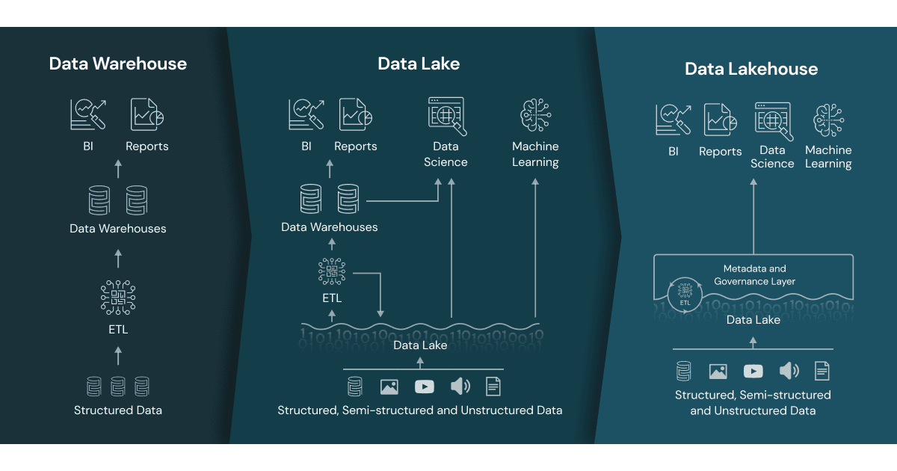
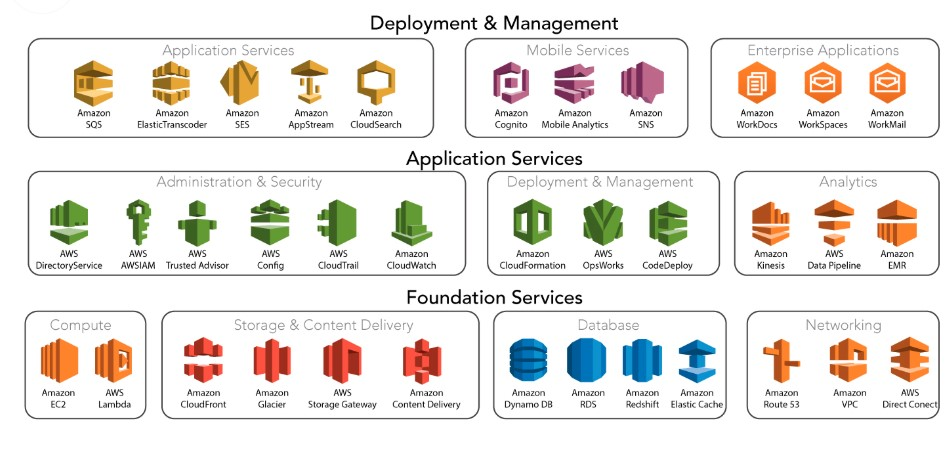

# Data 관련 직무 CS 정리
데이터 관련 직무의 면접 대비 겸 꼭 알아야 하는 CS 기초 내용들을 정리해보았다.

------------------------------
# 0. Language and Environment
## Python

-----------------------------------
## Java
객체 지향적 프로그래밍 언어아저 소프트웨어 플랫폼으로 규칙과 구문은 C 및 C++ 언어를 기반으로 한다. JDK(Java Development Kit)를 다운로드하여 자바 프로그래밍 언어로 프로그램을 제작할 수 있으며, 자바 컴파일러가 프로그램을 JAVA 바이트 코드, 즉 자바 런타임 환경의 일부인 JVM(Java Virtual Machine)으로 변환한다. 이 자바 바이트 코드는 JWM을 지원하는 모든 시스템에서 어디에서나 실행할 수 있다. 이 덕분에 자바는 OS에 독립적인 특징을 가지는데, 컴파일 과정을 통해 알아보자. 

### 자바 컴파일 순서
1. 자바 소스코드 작성
2. 자바 컴파일러가 자바 소스 파일을 컴파일한다. 이따 자바 바이트 코드(.class)가 생기며 이 파일은 아직 컴퓨터는 읽지 못하지만 자바 가상 머신이 읽을 수 있는 코드로, 1바이트 크키의 Opcode과 추가 피연산자로 이루어져 있다.
3. 컴파일된 바이트 코드를 JVM의 클래스로더에게 전달한다.
4. 클래스 로더는 동적 로딩(dynamic loading)을 통해 필요한 클래스들을 로딩 및 링크하여 런타임 데이터 영역, 즉 JVM의 메모리에 올린다. 아래는 클래스 로더 세부 동작 순서이다.
    + 로드 : 클래스 파일을 가져와서 JVM의 메모리에 로드
    + 검증 : 자바 언어 명세(Java Language Specification) 및 JVM 명세에 명시된 대로 구성되어 있는지 검사
    + 준비 : 클래스가 필요로 하는 메모리를 할당 (필드, 메서드, 인터페이스 등등)
    + 분석 : 클래스의 상수 풀 내 모든 심볼릭 레퍼런스를 다이렉트 레퍼런스로 변경
    + 초기화 : 클래스 변수들을 적절한 값으로 초기화 (static 필드)
5. 실행 엔진(execution engine)은 JVM 메모리에 올라온 바이트 코드를 하나씩 가져와서 실행한다. 이때 실행 엔진은 두가지 방식으로 변경된다.
    + 인터프리터: 바이트 코드 명령어를 하나씩 읽어서 해석하고 실행한다.
    + JIT 컴파일러: 바이트 코드 전체를 컴파일해서 바이너리 코드로 변경한 뒤, 바이너리 코드를 직접 실행한다.


### 자바 가상 머신 (Java Virtual Machine)
JVM은 시스템 메모리를 관리하면서 자바 기반 애플리케이션을 위해 이식 가능한 실행 환경을 제공한다. 또한 프로그램 메모리를 관리하고 최적화한다. 개발자들이 말하는 JVM은 보통 어떤 기기상에서 실행되고 있는 프로세스, 특히 자바 앱에 대한 리소스를 대표하고 통제하는 서버를 지칭한다.
JVM 실행에 있어 가장 기본적인 상호작용은 힙과 스택의 메모리 사용을 확인하는 것으로 다음과 같이 진행된다.
1. 자바 프로그램이 실행되면 JVM은 OS로부터 이 프로그램이 필요로 하는 메모리를 할당받는다. JVM은 이 메모리를 용도에 따라 여러 영역으로 나눠 관리한다.
2. 자바 컴파일러(JAVAC)가 자바 소스 코드를 읽고 자바 바이트 코드(.class)로 변환시킨다. 
3. 변경된 class 파일들을 클래스 로더를 통해 JVM 메모리 영역으로 로딩한다.
4. 로딩된 class 파일들은 execution engine을 통해 해석된다.
5. 해석된 바이트 코드는 메모리 영역에 배치되어 실질적인 수행이 이루어지는데, 여기서 JVM은 필요에 따라 스레드 동기화나 가비지 컬렉션과 같은 메모리 관리 작업을 수행한다. 


### 가비지 컬렉션(Garbage Collection)
C/C++ 프로그래밍을 할 때 메모리를 효율적으로 쓰기 위해 사용하지 않는 객체의 메모리를 프로그래머가 직접 해제를 했었다. 그러나 자바에서는 JVM의 JRE(Java Runtime Environment)에 가비지 컬렉션이 자동으로 사용하지 않는 객체를 파괴한다. 물론 가비지 컬렉션을 실행하지 위해 애플리케이션 실행이 멈추는 것은 피할 수 없으며 대개의 튜닝은 멈추는 stop-the-world 시간을 줄이는 것이다.   
JVM의 메모리는 총 5가지의 영역(class, stack, heap, native method, PC)로 나뉘는데, 가비지 컬렉션은 힙 메모리만 다루며 그 대상은 다음과 같다.
1. 객체가 NULL인 경우
2. 블럭 실행 종료 후, 블럭 안에서 생성된 객체
3. 부모 객체가 NULL인 경우, 포함하는 자식 객체

-------------------------------

## Kotlin
코틀린은 전 세계 안드로이드 개발자가 널리 사용하는 프로그램으로 자바와 유사하지만 더욱 간단하고 효율적인 언어로 자바의 단점을 보완했다.

## R
R은 통계 계산과 그래픽을 위한 프로그래밍 언어로, 광범위한 통계 및 그래픽 라이브러리를 보유하고 있는 오픈 소스다. 교육용이나 학계에서 사용될 뿐만 아니라 구글, 우버, 에어비엔비 등의 대기업에서도 사용하는데 R을 사용한 데이터 분석으로 통계적 추론, 데이터 분석, 머신러닝 알고리즘에 쓰인다. 

--------------------------
## Git
깃(git)은 분산 버전관리 시스템으로 여러 명의 개발자가 하나의 소프트웨어 개발에 참여하거나 버전 관리가 필요할 때 사용된다. 그렇다면 깃허브(Github)란 무엇일까? 깃을 사용하는 프로젝트를 지원하는 웹 호스팅 서비스를 말한다. 

## Docker
도커는 컨테이너를 다루는 도구로 도커 엔진, 혹은 도커에 관련된 모든 프로젝트를 말한다. 도커 엔진은 컨테이너를 생성하고 관리하는 주체이자. 도커의 구성 요소에 대해 알아보자.
- Docker Client: 도커를 설치하면 그것이 client며 build, pull, run 등의 도커 명령어를 수행한다.
- DOCKER_HOST: 도커가 띄워져있는 서버를 의미하며 도커 호스트에서 컨테이너와 이미지를 관리한다.
- Docker daemon: 도커 엔진을 말한다.
- Registry: 외부 이미지 저장소로 다른 사람이 공유한 이미지를 내부 도커 호스트에 pull할 수 있고, 가져온 이미지를 run하면 컨테이너가 된다.
- **컨테이너(Container)**: 하나의 애플리케이션과 구동되는 환경까지 감싸서 실행할 수 있도록 하는 격리 기술   
   
도커 엔진에서 사용하는 기본 단위는 이미지와 컨테이너로 도커 이미지와 컨테이너는 1:N이다. 도커 이미지는 컨테이너를 생성할 때 필요한 읽기 전용 바이너리 파일이다. 도커 이미지의 이름은 기본적으로 아래와 같은 형태다. 
```
[저장소이름]/[이미지이름]:[태그]
# 저장소 이름: 이미지가 저장된 장소
# 이미지 이름: 해당 이미지의 역할 설정
# 태그: 이미지의 버전을 나타냄
```
### 도커 컨테이너(Docker Container)
도커 컨테이너는 도커 이미지로 생성할 수 있으며, 컨테이너를 생성하면 이미지 파일에 맞게 호스트와 다른 컨테이너로부터 격리된 시스템 자원 및 네트워크를 사용할 수 있는 독립된 공간(프로세스)가 생성된다. 

---------------------

## 쿠버네티스(Kubernetes)
쿠버네티스는 컨테이너화된 워크로드와 서비스를 관리하기 위한 이식성이 있는 확장 가능한 오픈소스 플랫폼으로, 컨데이너를 오케스트레이션 하는 도구이다. 여기서 오케스트레이션은 여러 서버에 걸친 컨테이너와 환경 설정을 관리하는 행위를 말한다. 즉, 쿠버네티스는 여러 서버(노드)에 컨테이너를 분산해서 배치하거나, 문제가 생긴 컨테이너를 교체하거나, 컨테이너가 사용할 비밀번호나 환경 설정을 관리하고 주입해주는 일 등을 한다.k8s는 쿠버네티스의 k와 s 사이의 8글자를 나타내는 약식 표시로, 구글이 오픈 소스로 한 쿠버네티스 프로젝트를 칭한다. 그럼 쿠버네티스가 왜 필요하고 무엇을 할 수 있는지를 살펴보겠다.


### 쿠버네티스의 기능
쿠버네티스는 컨테이너 분산 시스템을 탄력적으로 실행하기 위한 프레임 워크를 제공한다. 구체적으로 제공하는 기능은 다음과 같다.
- 서비스 디스커버리와 로드 밸런싱: 쿠버네티스는 DNS 이름을 사용하거나 자체 IP 주소로 컨테이너를 노출할 수 있다. 컨테이너에 대한 트래픽이 많으면 쿠버네티스는 네트워크 트래픽을 로드밸런싱하고 배포하여 배포가 안정적으로 이루어지도록 한다. 
- 스토리지 오케스트레이션: 쿠버네티스를 사용하면 로컬 저장소, 공용 클라우드 공급자 등과 같이 원하는 저장소 시스템을 자동으로 탑재할 수 있다. 
- 자동화된 롤아웃과 롤백: 쿠버네티스를 사용하여 배포된 컨테이너의 원하는 상태를 서술할 수 있고, 원하는 상태로 변경할 수 있다. 예를 들어, 쿠버네티스를 자동화해서 배포용 새 컨테이너를 만들고 기존 컨테이너는 제거하여 모든 리소스를 새 컨테이너에 적용할 수 있다.
- 자동화된 빈 패킹: 컨테이너화된 작업을 실행할 수 있는 쿠버네티스 클러스터 노드를 제공한다. 각 컨테이너가 필요로 하는 CPU와 메모리(RAM)을 쿠버네티스에 요청하면 컨테이너를 노드에 맞춰 리소스를 가장 잘 사용할 수 있도록 해준다.
- 자동화된 복구: 쿠버네티스는 실패한 컨테이너를 다시 시작하고 컨테이너를 교체한다. 사용자 정의 상태 검사에 응답하지 않는 컨테이너는 죽이고 서비스 준비가 끝날 때까지 그러한 과정을 클라이언트에게 보여주지 않는다.
- 시크릿과 구성 관리: 쿠버네티스를 사용하면 암호, OAuth 토큰 및 SSH 키와 같은 중요한 정보를 저장하고 관리할 수 있다. 컨테이너 이미지를 재구성하지 않고 스택 구성에 시크릿을 노출하지 않고도 시크릿 및 애플리케이션 구성을 배포 및 업데이트 할 수 있다.

## 쿠버네티스의 구성요소
쿠버네티스를 배포하면 클러스터를 얻는다. 쿠버네티스 클러스터는 컨테이너화된 애플리케이션을 실행하는 **노드**라고 하는 워커 머신의 집합으로, 모든 클러스터는 최소 한개의 워커 노드를 가진다.   
워커 노드는 애플리케이션의 구성 요소인 파드를 호스트한다. 컨트롤 플레인은 워커 노드와 클러스터 내 파드를 관리한다. 일반적으로 컨트롤 플레인은 여러 컴퓨터에서 실행되고, 클러스터는 여러 노드를 실행하므로 내결함성과 고가용성을 지닌다.

### 컨트롤 플레인 컴포넌트
컨트롤 플레인 컴포넌트는 클러스터에 관해 스케줄링과 같은 전반적인 결정을 하고 클러스터 이벤트를 감지해서 반응한다. 컨트롤 플레인 컴포넌트의 요소돌을 살펴보겠다.
- kube-apiserver: api 서버는 쿠버네티스 api를 노출하는 쿠버네티스 컨트롤 플레인 컴포넌트다. api 서버는 이 컨트롤 플레인의 프론트 엔드이며, 수평으로 확장되도록 디자인되었기 때문에 더 많은 인스턴스를 배포해서 확장할 수 있다. 또한 여러 kube-apiserver 인스턴스를 실행하고, 인스턴스 간의 트래픽을 균형있게 조절할 수 있다. 
- etcd: 모든 클러스터 데이터를 담는 쿠버네티스 뒷단의 저장소로 사용되는 일관성,고가용성 키-값 저장소이다. 
- kube-scheduler: 노드가 배정되지 않은 새로 생성된 파드를 감지하고 실행할 노드를 선택하여 배정한다.
- kube-controller-manager: 컨트롤러 프로세스를 실행하는 컨트롤 플레인 컴포넌트로 노드 컨트롤러, 잡 컨트롤러, 앤드포인트 슬라이스 컨트롤러, 서비스 어카운트 컨트롤러 등을 포함한다.
- cloud-controller-manager: 클라우드별 컨트롤 로직을 담당하여 클러스터를 클라우드 공급자의 api에 연결하고, 해당 클라우드 플랫폼이 이 컴포넌트를 구분할 수 있게 한다.

### 노드 컴포넌트
노드 컴포넌트는 동작 중인 파드를 유지시키고 쿠버네티스 런타임 환경을 제공하며 모든 노드 상에서 동작한다. 
- kubelet: 클러스터의 각 노드에서 실행되는 에이전트로, 파드에서 컨테이너가 확실하게 동작하도록 관리한다. 
- kube-proxy: kube-proxy는 클러스터의 각 노드에서 실행되는 네트워크 프록시로 네트워크 규칙을 유지 및 관리하며, 이 네트워크 규칙은 내부 네트워크 세션이나 바깥에서 파드로 네트워크 통신을 할 수 있게 해준다.
- 컨테이너 런타임: 컨테이너 런타임은 컨테이너 실행을 담당하는 소프트웨어다.

### 애드온
애드온은 쿠버네티스 리소스로 클러스터 기능을 구현하는 쿠버네티스 시스템에 속한다.
- DNS: 모든 쿠버네티스 클러스터는 클러스터 DNS를 갖추어야 하는데, 이 클러스터 DNS는 구성환경 내 다른 DNS 서버와 더불어, 쿠버네티스 서비스를 위해 DNS 레코드를 제공해주는 서버다.
- 웹 UI (대시보드): 대시보드는 쿠버네티스 클러스터를 위한 범용의 웹 기반 UI다. 사용자가 클러스터 자체뿐만 아니라, 클러스터에서 동작하는 애플리케이션에 대한 관리와 문제 해결을 할 수 있도록 해준다.
- 컨테이너 리소스 모니터링: 컨테이너 리소스 모니터링은 중앙 데이터베이스 내의 컨테이너들에 대한 포괄적인 시계열 매트릭스를 기록하고 그 데이터를 열람하기 위한 UI를 제공해 준다.
- 클러스터-레벨 로깅: 클러스터-레벨 로깅 메커니즘은 검색/열람 인터페이스와 함께 중앙 로그 저장소에 컨테이너 로그를 저장하는 책임을 진다.


### 도커와 쿠버네티스의 차이
도커와 쿠버네티스는 둘다 컨테이너 기술로, 마이크로 서비스를 다양한 플랫폼에서 배포가 가능한 프로그램으로 패킹하는 소프트웨어 도구를 제공한다. 도커는 전통적인 방식보다 더 빠르게 애플리케이션을 구축, 테스트 배포할 수 있도록 하는 컨테이너 런타임 기술이다. 쿠버네티스는 컨테이너 시스템을 확장하여 대규모로 컨테이너를 관리, 조정, 예약할 수 있는 컨테이너 오케스트레이션 도구다. 즉, 도커는 이미지로 컨테이너를 띄우고 실행하는 기술이고 쿠버네티스는 도커를 관리하는 툴이자 여러 개의 컨테이너를 서비스 단위로 관리하는 데에 최적화된 기술이다.   
   


---------------------------

# 1. DB / Cloud Service 이해
## Data Lake와 Data Warehouse
먼저 데이터를 저장하고 처리하는 리포지토리의 두 종류를 살펴보겠다.
### 데이터 레이크(Data Lake)
데이터 레이크는 대량의 데이터를 원본 형식으로 수집하고 저장하는 중앙 집중식 저장소다. 개방적이고 확장 가능한 아키텍처로 구조적 데이터(데이터베이스 테이블, 엑셀 시트)부터 반구조적 데이터(XML 파일, 웹 페이지), 비구조적 데이터(이미지, 오디오 파일, 트윗 등)까지 모든 소스의 모든 데이터를 수용할 수 있다.

### 데이터 웨어하우스 (Data Warehouse)
데이터 웨어하우스는 보고 및 분석을 위해 구조화된 데이터와 반구조화된 데이터를 저장하는 중앙 집중식 저장소로 다양한 소스에서 유입된 데이터는 일반적으로 창고에 도착하기 전에 정리되고 표준화된다. 데이터마트는 단일 주제 및 Line of Bussiness에 초점을 맞춘 단순한 형태의 데이터 웨어하우스를 말하며 기업 내 특정 팀이 요청한 데이터에 대한 손쉬운 액세스를 제공한다.

### Data Lake와 DW 비교
데이타 웨어하우스는 분석을 위해 설계되었으므로, 대량의 데이터를 읽어 추세를 파악하는 작업이 포함되며, 데이터 레이크는 모든 유형의 데이터에 대한 중앙 리포지토리다. 

|내용|Data Warehouse|Data Lake|
|------|---|---|
|데이터|트랜젝션 시스템, 운영 데이터베이스 및 애플리케이션의 관계형 데이터|정형, 반정형, 비정형 등 모든 데이터|
|스키마|일부 경우 데이터 웨어하우스를 구현하기 전 설계하며 일반적으로 분석과 동시에 작성 가능|분석 시에 작성(스키마-온-리드)|
|가격/성능|로컬 스토리지를 사용해 가장 빠른 쿼리 결과를 얻음|저렴한 스토리지를 사용해 쿼리 결과가 빠르게 제공되며 컴퓨팅 및 스토리지는 분리|
|데이터 품질|신뢰할 수 있는 중앙 버전 역할로 큐레이트 된 데이터|큐레이트 될 수 있거나 될 수 없는 모든 데이터(원시데이터)|
|사용자|비즈니스 애널리스트, 데이터 사이언티스트 및 데이터 개발자|비즈니스 애널리스트, 데이터 사이언티스트, 데이터 개발자, 데이터 엔지니어|
|분석|배치 보고, BI 및 시각화|기계 학습, 예비 분석, 데이터 검색, 빅데이터 및 프로파일링|



## 데이터 프레임워크
프로젝트를 진행할 떄, 어떤 프레임워크의 데이터베이스를 선택할지 고민을 하게 된다. 적합한 데이터베이스를 선택하기 위해 각각의 특징과 차이점을 알아보자.

### SQL (관계형 데이터베이스)
SQL을 사용하면 RDBMS에서 데이터를 저장, 수정, 삭제 및 검색할 수 있다. 관계형 데이터베이스의 핵심적인 두가지 특징은 정해진 데이터 스키마가 있다는 점과 관계를 통해 여러 테이블에 분산된다는 점이다.
데이터는 테이블에 레코드로 저장되는데, 각 테이블마다 명확하게 정의된 구조가 있고 스키마를 준수하지 않는 레코드는 테이블에 추가할 수 없다. 또한 수직적 확장만 가능하며, 데이터의 중복을 피하기 위해 relation(관계)를 사용한다. 

- 장점: 명확하게 된 스키마, 데이터 무결성 보장, 중복 없이 한번만 저장
- 단점: 덜 유연하며 데이터 스키마를 사전에 계획해야 함, 관계로 인해 조인문이 많은 복잡한 쿼리가 만들어질 수 있음, 대체로 수직적 확장만 가능
- 사용하면 좋은 경우: 관계를 맺고 있는 데이터가 자주 변경되는 애플리케이션의 경우, 혹은 변경될 여지가 없는 명확한 스키마가 중요한 경우

### 데이터베이스 관리 시스템 - mysql 
순수 관계형 데이터베이스로 가장 널리 사용되는 관계형 데이터베이스다. 데이터를 행과 열이 있는 테이블로 저장할 수 있으며, 일반적으로 SQL이라고 하는 구조화된 쿼리 언어를 사용한다. 웹에 사용되고 서버에서 실행되는 시스템이다 크고 작은 응용 모두에 적합하며 빠르고 안정적이며 사용이 쉽다는 장점이 있다. 

### 데이터베이스 관리 시스템 - PostgreSQL
PostgreSQL은 객체 관계형 데이터베이스로 확장 가능성과 표준 준수를 강조하는 데이터베이스다. 다른 관계형 데이터베이스 시스템과 달리 연산자, 복합 자료형, 집계 함수, 자료형 변환자 등의 다양한 객체와 기능을 제공한다. 즉, 복잡한 쿼리와 대규모 데이터베이스를 다룰 수 있는 기능이 풍부하다는 장점이 있어 복잡한 대규모 분석 프로세스에 적합하다.
- MVCC(다중 버전 동시성 제어): PostSQL은 특정 시점 복구, 세분화된 액세스 제어, 테이블 스페이스, 비동기 복제, 온라인/핫 백업 등 동시성을 제어하기 위한 강력한 기능 세트를 보유하고 있다. 
- 신뢰성 및 표준 준수: PostSQL은 미리 쓰기 로깅으로 내결함성이 뛰어난 데이터베이스를 만든다. 모든 데이터는 ACID를 준수하며 다양한 언어로 된 외래키, 조인, 뷰, 트리거 및 저장 프로시저를 완벽하게 지원한다.
- 오픈소스 라이센스: 소스 코드는 오픈 소스 라이센스에 따라 제공되므로 필요에 따라 무료로 사용 및 수정, 구현할 수 있다. 

### NoSQL (비관계형 데이터베이스)
SQL과 반대로 스키마도 없고 관계도 없는 데이터베이스다. 레코드를 문서(documents)라고 부르며 다른 구조의 데이터를 같은 컬렉션에 추가하는 것이 가능하다. 문서는 Json과 비슷한 형태고 이 문서를 여러 테이블에 나누어 담는 것이 아닌, 관련 데이터를 하나의 동일한 컬렉션에 넣는다. 그러므로 수평적 확장이 가능하다. 조인을 하고 싶은 경우에는 컬렉션에서 데이터를 복제하여 포함해야 하며 데이터가 중복되는 위험이 있으므로, 용량이 큰 데이터가 조인을 사용하지 않고 잘 변경되지 않는 경우에는 NoSQL을 쓰는 것이 효율적이다. 

- 장점: 스키마가 없어서 유연함, 언제든지 저장된 데이터를 조정하고 새로운 필드를 추가할 수 있음, 애플리케이션이 필요로 하는 형식으로 데이터 저장이 가능함, 수직 및 수평 확장이 가능
- 단점: 유연성으로 데이터 구조 결정을 미루게 된다, 데이터 중복을 업데이트 해야 한다, 데이터가 여러 컬렉션에 중복되어 있는 경우, 수정 시 모든 컬렉션에서 수정해야 한다.
- 사용하기 좋은 경우: 정확한 데이터 구조를 알 수 없거나 변경/확장 될 수 있는 경우, 읽기는 자주 하되 변경은 자주 없는 경우, 데이터베이스를 수평으로 확장해야 하는 경우

### 데이터베이스 관리 시스템 - MongoDB
 MongoDB는 C++로 작성된 오픈소스 문서지향적 Cross-platform 데이터베이스이며, 뛰어난 확장성과 성능을 가진 가장 인지도 있는 NoSQL 데이터 베이스 시스템 중 하나다. 유연한 데이터 모델을 갖추고 있으며, 풍부하고 직관적인 API로 인덱싱과 복제 기능을 지원한다. 아래는 mongoDB 데이터의 유사한 예시며, MongoDB의 몇가지 기능을 살펴보겠다.
```json
{
  company_name: "ACME Limited Foodstuffs",
  address: {street: "1212 Main Street", city: "Springfield"},
  phone_number: "1-800-0000",
  industry: ["food processing", "appliances"]
  type: "private",
  number_of_employees: 987
}
```
- 임시 쿼리: 전체 문서 특정 문서 필드 또는 무작위 결과 샘플을 반환할 수 있는 필드, 범위 및 정규식 쿼리를 지원한다.
- 인덱싱: MongoDB 문서 필드는 기본 및 보조 인덱스로 인덱싱할 수 있으며, 단일 필드, 복합 다중 필드, 다중 키, 지리 공간, 텍스트 및 해시를 포함하여 다양한 인덱스 유형을 지원한다.
- 복제: 두 개 이상의 데이터 복사본을 포함하는 복제본 세트를 통해 고가용성을 제공한다. 쓰기는 기본 복제본에 의해 처리되는 반면, 모든 복제본은 읽기 요청을 처리할 수 있다.

------------------------

## AWS
AWS는 클라우드 컴퓨팅 서비스 중 하나로 먼저 클라우드 컴퓨팅에 대해 알아보자.

### Cloud Computing
클라우드 컴퓨팅은 IT 리소스를 인터넷을 통해 내가 필요한 만큼 On-demand로 제공받고, 사용한 만큼만 비용을 지불하는 것을 말한다. 물리적 데이터 센터와 서버를 구축해 유지 관리하는 대신에, Amazon Web Services(AWS)와 같은 클라우드 공급자로부터 필요에 따라 컴퓨팅 파워, 스토리지, 데이터베이스, 서버 등의 기술 서비스를 사용할 수 있다. 

### 클라우드 컴퓨팅의 이점
* 민첩성: 클라우드를 통해 광범위한 기술에 쉽게 액세스할 수 있으므로, 컴퓨팅, 스토리지 및 데이터 베이스와 같은 인프라 서비스부터 사물 인터넷, 기계 학습, 데이터 분석에 이르기까지 거의 모든 리소스를 빠르게 구축하여 구동할 수 있다.
* 탄력성: 리소스를 사전에 오버 프로비저닝할 필요가 없이 필요한 만큼 쓸 수 있다. 비즈니스 요구가 변화함에 따라 이러한 리소스를 즉시 확장하거나 축소할 수 있다.
* 비용 절감: 클라우드를 통해 고정 비용을 가변 비용으로 전환하고, 사용한 만큼만 IT 비용을 지불하기 때문에 훨씬 더 저렴한 비용이 사용된다.
* 배포 속도: 전 세계에 인프라가 있으므로 클릭 몇번으로 여러 물리적 위치에 쉽게 애플리케이션을 배포할 수 있다.

### 클라우드 컴퓨팅의 세가지 유형
1. Infrastructure as a Service(IaaS)
인프라 자원으로 확장성이 높고 자동화된 컴퓨팅 리소스를 가상화하여 서비스로 제공하는 것을 말한다. 서버, 네트워크, OS, 스토리지 등의 물리적 사원을 가상화하여 UI 형태의 대시보드 또는 API로 제공한다.

2. Platform as a Service(PaaS)
응용 프로그램을 개발할 때 필요한 플랫폼을 서비스로 제공하는 것을 말한다. OS, 미들웨어, 런타임과 같은 플랫폼을 제공하기 때문에 개발자는 운영체제나 소프트웨어 업데이트, 저장소와 같은 인프라에 대한 관리 없이 소프트웨어 개발에 집중할 수 있다.

3. Software as s Service(SaaS)
소프트웨어와 데이터, 즉 응용 프로그램을 가상화하여 서비스로 제공하는 것을 말한다. 기존에는 패키지 또는 On-premise 방식으로 소프트웨어를 전달했지만 클라우드 컴퓨팅에서는 다운로드 및 설치할 필요가 없이 쓸 수 있다. 물리적 자원이 없어도 되고, 비용 부담도 덜 수 있고 즉시 사용이 가능하지만 커스터마이징이 어렵다는 단점이 있다.


### AWS란?
아마존에서 재공하는 클라우드 서비스 Amazon Web Services의 약자로, 네트워킹을 기반으로 가상 컴퓨터와 스토리지, 네트워크 인프라 등 다양한 서비스를 제공하고 있다. 주요 서비스는 다음 그림과 같으며, 대표적인 몇가지를 살펴보겠다.


### AWS Server - EC2(Elastic Compute Cloud)
안전하고 크기 조정이 가능한 컴퓨팅 파워를 클라우드로 제공하는 웹 서비스로 가상의 컴퓨터를 빌리는 것과 같은 가상 서버다. 컴퓨터를 빌리는 것을 Instance를 생성한다고 말하며, 웹 서버를 설치하고 웹 브라우저를 통해 요청하여 서비스를 사용하는 것이 가장 기본적인 방법이다. 그렇기 때문에 구성에 드는 시간이 짧고 AMI를 통해 다양한 운영체제, CPU, RAM, 용량 등을 선택하여 구성할 수 있다.

- AMI: 소프트웨어 구성이 기재된 템플릿이다. 용도에 맞춰 운영체제, 런타임, 용량 등이 구성된 세팅을 선택하고 이 선택한 AMI를 토대로 인스턴스가 구성된다. 
- Auto Scailing: 애플리케이션 가용성을 유지하기 위해 사용자가 정의한 조건에 따라 자동적으로 EC2 용량이 확장되고 축소된다.

### AWS Storage - S3(Simple Storage Service)
파일 서버 역할을 하는 객체 스토리지 서비스로 높은 안정성과 확장성, 보안 및 규정 준수 기능, 유연한 관리, 쿼리 지원 등의 장점이 있다.
- 버킷: S3에 저장되는 파일들을 담는 바구니로, 파일을 저장하는 최상위 디렉토리다. 모든 파일은 버킷 안에 저장되어야 하며, 무한히 많은 파일을 저장할 수 있다. 각각의 버킷 이름은 버킷이 속해 있는 리전(지역)에서 유일해야 한다.
- 객체: S3에서 저장소에 데이터를 저장할 때, 키-값 페어 형식으로 저장하기 때문에 파일을 객체하고 부른다. 파일의 키는 식별자 역할을 하며, 객체는 파일과 메타데이터(생성일,크기,유형)으로 구성된다. 모든 객체는 고유한 URL 주소(http://버킷이름/S3.amazonaws.com/객체키)를 가지고 있으며 이를 통해 접근이 가능하다.

### AWS Storage - EBS(Elastic Block Store)
EC2 instance에 직접 붙여서 사용하는 볼륨형 스토리지로 일종의 하드디스크라고 생각하면 된다. Root EBS 볼륨은 각 OS마다의 최소 용량이 정해져 있다.

### AWS Database - RDS
관리형 관계형 데이터베이스 서비스로서, 고객이 선택할 수 있도록 Amazon Aurora, MySQL, MariaDB, Oracle, Microsoft SQL Server, PostgreSQL과 같은 6개의 익숙한 데이터베이스 엔진을 제공한다. 사용하기 편하며 성능과 확장성이 높고 가용성 및 내구성도 뛰어나다. 데이터베이스 스냅샷을 남길 수 있으며 높은 보안 수준을 지닌다.

### AWS Management - Cloud Watch
AWS 클라우드 리소스와 AWS에서 실행되는 애플리케이션을 위한 모니터링 서비스로 지표를 수집 및 추적하고, 로그 파일을 수집 및 모니터링하며, 경보를 설정하고, AWS 리소스 변경에 자동으로 대응할 수 있다. 
- Amazon EC2 모니터링: 추가 비용 없이 EC2 인스턴스의 CPU 사용률, 데이터 전송, 디스크 사용에 대한 지표를 확인할 수 있다. 지표 집계 및 세부 모니터링은 추가 비용을 지불하여 이용 가능하다.

### Load Balancing
로드 밸런서는 클라우드와 서버 그룹 사이에서 서버에 가해지는 트래픽을 여러 대의 서버에 고르게 분배하여 특정 서버에 부하가 몰리는 걸 방지하는 역할을 한다. 기본적인 방식은 scale up과 scale down 으로, 기존 서버의 성능을 향상시켜서 더 많은 부하를 감당할 수 있도록 하는 것이 스케일 업 방식이고, 트래픽을 여러 대의 서버에 분산시켜 처리하는 스케일 아웃 방식이다.

위에서 다룬 것들은 자주 접할 수 있는 서비스이고, 그 이상으로 수많은 서비스를 제공하고 있기 때문에 여러 서비스에 대해 알아보면서 우리의 목적에 맞는 것을 적절하게 활용할 수 있도록 고민하고 적용하는 것이 중요하다. 

-------------------------------
# 2. Data ETL
## pandas
## 컨테이너 관리를 위한 k8s
## 데이터 저장을 위한 hadoop
## 데이터 저장을 위한 mongodb
## 데이터 포맷팅을 위한 Iceberg, parquet, orc

--------------------------------------
# 3. Data Analysis & Modeling
## scikit-learn
## Jupyter
## Tensorflow
데이터_분석_모델.md

--------------------------
# 4. Data Visualization
* 대시보드 및 데이터 분석 UI 제공을 위한 redash, tableau
* 데이터시각화.md

----------------------------
# 5. Big Data Pipeline
•	데이터 분석 및 파이프라인 개발을 위한 spark, airflow, jupyter, trino, pandas, kafka

----------------------------
# 6. Data Serving
## Spring 
## fastAPI
## Kafka
## MLflow
## bentoml

그 외
Django
JavaSript
Crontab
konlpy
andriod studio
