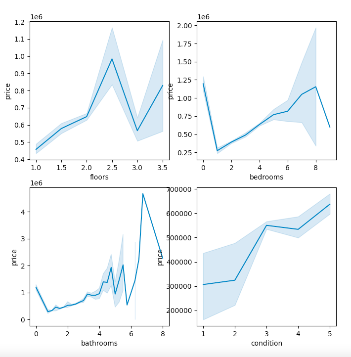
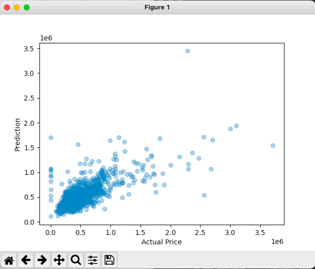
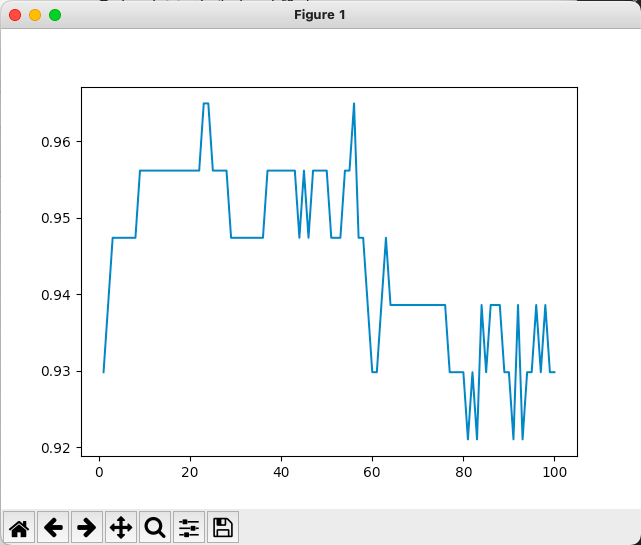

# 1. 선형 회귀(Linear Regression)
대표적인 머신러닝 데이터 분석의 목적 중 하나는 실제 데이터를 바탕으로 모델을 생성해서 다른 입력 값에 대해서도 발생할 아웃풋을 예측하는 것이다. 여기서 가장 직관적이고 간단한 모델은 선으로 선을 표현한 모델이 선형 회귀 모델이다.    
 
### MSE(Mean Square Error) = 평균 제곱 오차
데이터를 놓고 선을 긋는 다는 건 대충 어림잡을 수 있는 정도를 찾는다는 것인데, 그렇기 때문에 실제 데이터와 차이가 존재한다. 이 차이를 손실(Loss)이라고 부르며 음과 양이 될 수 있으므로 모든 손실에 제곱을 헤준 평균 제곱 오차라는 손실을 많이 사용한다.   
선형 회귀 모델의 목표는 모든 데이터로부터 나오는 오차의 평균을 최소화할 수 있는 최적의 기울기와 절편 값을 찾는 것이다. 그렇다면 어떻게 손실을 최소화할 수 있을까?

### 경사하강법(Gradient Descent)
손실을 함수로 나타내면 아마 아래로 볼록한 모양이 될 것이다. 그럼 이 모델은 임의로 파라미터를 정한 다음 미분을 통해 기울기를 구해 손실을 조금씩 줄여가는 방법으로 최적의 파라미터를 찾아낸다. 이 방법을 경사하강법이라고 부른다. 


### 수렴(Convergence)
위에서 말한대로 선형 회귀 분석을 수행하면 기울기와 절편을 계속 변경해가며 최적의 값을 찾을 것이다. 하지만 이 작업을 언제까지 할 지 모른다. 선형회귀 모델은 어느정도 적당한 최적의 값으로 수렴하도록 그 기준을 정한다. 여기서 우리는 관여하지 않지만 학습률이라는 걸 정해줘야 한다. 

### 학습룰(Learning Rate)
학습률이 너무 크면 최적의 값을 제대로 찾지 못하고 듬성듬성 보게 된다. 하지만 너무 작게 설정한다면 최적의 값으로 수렴할 때까지 너무 오래 걸리게 된다. 그러므로 효율적으로 파라미터를 조정하면서도 최적의 값을 찾을 수 있는 수준으로 적절한 학습률을 지정해줘야 한다.    

### 코드
그럼 집 값 데이터셋과 sklearn의 LinearRegression을 사용해 선형 회귀 예측 모델을 만들어보겠다.   
먼저 데이터 중 예측에 사용할 변수들과 가격 사이의 관계를 시각화한다.
```python
fig, axs = plt.subplots(2, 2, figsize=(8,8))
ax1, ax2, ax3, ax4 = axs.flatten()
ax1 = sns.lineplot(x = 'floors', y = 'price', data = df, ax = ax1)
ax2 = sns.lineplot(x = 'bedrooms', y = 'price', data = df, ax = ax2)
ax3 = sns.lineplot(x = 'bathrooms', y = 'price', data = df, ax = ax3)
ax4 = sns.lineplot(x = 'condition', y = 'price', data = df, ax = ax4)
plt.show()
```


다음으로 예측 모델을 생성하여 예측을 진행해보고 모델의 상수와 결과값을 확인해보자.
```python
from sklearn.linear_model import LinearRegression
from sklearn.model_selection import train_test_split
import pandas as pd
import numpy as np
import seaborn as sns
import matplotlib.pyplot as plt


df = pd.read_csv('./data/data.csv')

# 집 값 예측
x = df[['bedrooms','bathrooms','sqft_living','sqft_lot','floors','waterfront','view','condition']]
y = df['price']
x_train, x_test, y_train, y_test = train_test_split(x, y, train_size=0.8, test_size=0.2)

model = LinearRegression()
model.fit(x_train, y_train)
my_house = [[3, 2, 960, 4000, 5, 0, 2, 4]]
my_predict = model.predict(my_house)
print(my_predict)
y_predict = model.predict(x_test)
plt.scatter(y_test, y_predict, alpha=0.4)
plt.xlabel("Actual Price")
plt.ylabel("Prediction")
plt.show()
print(model.coef_)
print(model.score(x_train, y_train))\
```



```
my_predict = [399172.29723919]
model.coef_ = [-5.13417666e+04  1.75900762e+04  2.62336210e+02 -6.13391540e-01
  6.17548725e+03  3.47525933e+05  4.84682562e+04  4.98011400e+04]
model.score = 0.17592338707790034
```

정확도가 매우 낮은 걸 확인하고, 좀 더 가격에 영향을 주는 몇개의 변수를 뽑아서 해봐야겠다는 생각이 들었다. 

   
------------------------------------
   
      
# 2. 로지스틱 회귀(Logistic Regression)
선형 회귀와 같은 기본분석 모델이고 상당히 유사하지만 다루는 문제 유형이 다르다. 선형 회귀 분석은 연속된 변수를 예측하는 반면, 로지스틱 회귀 분석은 두 가지로 나뉘는 분류 문제를 다룬다. 그러므로 종속 변수와 독립 변수가 선형 관계에 있는 데이터에 적합한 분석 모델이다. 파이썬 머신러닝 scikit-learn을 통해 로지스틱 회귀 알고리즘으로 심정지 발생 가능성 여부를 예측해보겠다. 데이터는 캐글의 Heart Attack Analysis & Prediction Dataset을 이용하겠다.

### 데이터 불러오기
```python
import pandas as pd
df = pd.read_csv("./data/heart.csv")
print(df.head(10))
print(df.shape)
```
```
   age  sex  cp  trtbps  chol  fbs  restecg  thalachh  exng  oldpeak  slp  caa  thall  output
0   63    1   3     145   233    1        0       150     0      2.3    0    0      1       1
1   37    1   2     130   250    0        1       187     0      3.5    0    0      2       1
2   41    0   1     130   204    0        0       172     0      1.4    2    0      2       1
3   56    1   1     120   236    0        1       178     0      0.8    2    0      2       1
4   57    0   0     120   354    0        1       163     1      0.6    2    0      2       1
Index(['age', 'sex', 'cp', 'trtbps', 'chol', 'fbs', 'restecg', 'thalachh',
       'exng', 'oldpeak', 'slp', 'caa', 'thall', 'output'],
      dtype='object')
(303, 14)
```
14개 컬럼과 303개의 데이터가 있는 걸 확인했다. 여기서 타깃 컬럼은 output일 것이다.

### 데이터 전처리하기
분석에 사용할 feature를 골라야 한다. 심정지 발생 가능성에 중요한 영향을 미칠 것으로 예상되는 값은 trtpbs(안정시 혈압), chol(콜레스테롤 수치), Rest_ecg(휴식 중인 심전도 결과), thalachh(최대 심박수) 등이 있다. 해당 컬럼들이 결측치가 있는지 체크해준다.
```python
df.isnull().sum()
age         0
sex         0
cp          0
trtbps      0
chol        0
fbs         0
restecg     0
thalachh    0
exng        0
oldpeak     0
slp         0
caa         0
thall       0
output      0
dtype: int64
```


### 학습세트/평가세트 분리하기
```python
from sklearn.model_selection import train_test_split

features = df[['trtpbs', 'chol', 'Rest_ecg', 'thalachh']]
result = df[['output']]
train_x, test_x, train_y, test_y = train_test_split(features, result,  train_size=0.8, test_size=0.2)
```

### 데이터 정규화하기 (스케일링)
굉장히 중요한 단계로 데이터를 특정 규모로 스케일링하는 작업이다. 로지스틱 회귀는 실행할 때 regularation을 사용하기 때문에 반드시 이 작업이 필요하다.    
sklearn에서 제공하는 StandardScaler를 활용해서 손쉽게 할 수 있는데 이 방법은 평균 0, 표준편차 1로 변환하는 방법이라고 이해하면 된다. 이 외에도 최소값 0, 최대값 1이 되도록 변환하는 스케일러는 MinMaxScaler이고, 중앙값이 0, IQR이 1이 되도록 변환하는 스케일러는 RobustScaler이다. 여기서는 StandardScaler를 사용하겠다.

```python
from sklearn.preprocessing import StandardScaler
scaler = StandardScaler()
train_features = scaler.fit_transform(train_x)
test_features = scaler.fit_transform(test_x)
```


### 모델 생성 및 평가하기
```python
from sklearn.linear_model import LogisticRegression
model = LogisticRegression()
model.fit(train_features, train_y)

print(model.score(train_features, train_y))
print(model.score(test_features, test_y)) 
print(model.coef_)     
```
```
0.7107438016528925
0.6721311475409836
[[-0.27381889 -0.15581091  0.17945084  1.06765183]]
```


### 예측하기
```python
import numpy as np
Jack = np.array([61, 300, 2, 175])
Rose = np.array([70, 240, 0, 155])
Me = np.array([71, 160, 1, 170])

sample = np.array([Jack, Rose, Me])
sample = scaler.transform(sample)
print(model.predict(sample))
print(model.predict_proba(sample))

# [1 1 1]
# [[0.08893347 0.91106653]
#  [0.38613372 0.61386628]
#  [0.14388186 0.85611814]]
```
왼쪽이 심장마비 확률이 감소할 확률, 오른쪽은 심장마비 확률이 증가할 확률이다. 결과를 보면 Jack - Me - Rose 순서로 심장마비 확률이 높은 것 같다.

# 3. K-최근접 이웃(KNN)
K-최근접 이웃은 거리 기반 모델이다. 이 모델은 선형 관계를 전제로 하기 않고 데이터 간의 거리를 활용해서 새로운 데이터를 예측하는 모델이다. 이때 가까이 있는 데이터들을 고려해 예측값이 결정되는데, k-nearest Neighbors라는 이름에 가장 가까운 이웃 데이터들에 의해 예측된다는 의미가 담겨 있다.    
n개의 특성을 가진 데이터를 n차원의 공간에 점으로 개념화하며, 데이터 사이의 거리를 계산해 가까운 데이터끼리는 유사한 특성을 가진다고 판단한다. 분류를 알 수 없는 데이터에 대해 가장 가까운 이웃 K개의 분류를 확인하여 분류를 예측하고, 분류기의 효과를 높이기 위해 k값을 조정할 수 있다. 
- 다중 분류 문제
- 선형 관계 등의 가정이 필요 없음
- 다만 데이터가 커질 수록 상당히 느려지며 아웃라이어에 취약함

### k 개수 선택
k를 몇으로 정할 것인가의 문제는 실제로 테스트하면서 분류 정확도를 계산하는 과정에서 단서를 찾을 수 있다.   
k가 너무 작으면 아주 근처에 있는 점 일부에만 민감하게 영향을 받기 때문에 과적합이 될 수 있다. 아웃라이어도 있기 때문에 오버피팅이 발생하지 않도록 적절하게 넓은 시야로 고려되어야 한다.
k가 너무 크면 과소적합이 발생할 수 있다. 학습 세트에 세세한 부분까지 충분히 살펴보지 못하게 되고, 보편적인 결과로 데이터 속의 특징이나 패턴을 잘 적용하지 못하게 된다.    
학습 과정에서 분류 정확도를 통해 과적합인지 과소적합인지 확인하며 적절한 K값을 지정해주는 것이 중요하다. 

### 데이터 준비
여기서는 sklearn에서 제공하는 유방암 데이터를 사용해보겠다.
데이터를 불러와서 확인해보자.
```python
import pandas as pd
from sklearn.datasets import load_breast_cancer

breast_cancer_data = load_breast_cancer()
df = pd.DataFrame(breast_cancer_data.data)
df_target = pd.DataFrame(breast_cancer_data.target)

print(df.head())
print(df_target.head())
print(df.describe())
```
```
count  569.000000  569.000000  ...  569.000000  569.000000
mean    14.127292   19.289649  ...    0.290076    0.083946
std      3.524049    4.301036  ...    0.061867    0.018061
min      6.981000    9.710000  ...    0.156500    0.055040
25%     11.700000   16.170000  ...    0.250400    0.071460
50%     13.370000   18.840000  ...    0.282200    0.080040
75%     15.780000   21.800000  ...    0.317900    0.092080
max     28.110000   39.280000  ...    0.663800    0.207500
```
항목마다 스케일이 너무나 다르고 데이터마다 편차가 큰 것을 확인할 수 있다. 학습에 사용하기 전 정규화를 해줘야겠다.

### 정규화 및 데이터 세트 분리
```python
from sklearn.preprocessing import MinMaxScaler
from sklearn.model_selection import train_test_split

train_data, test_data, train_labels, test_labels = train_test_split(df, df_target, test_size=0.2, random_state=100)

scaler = MinMaxScaler()
train_features = scaler.fit_transform(train_data)
test_features = scaler.fit_transform(test_data)

print(train_features)
print(len(train_features), len(test_features))

# [[0.28723555 0.30899654 0.26826066 ... 0.03827075 0.20765027 0.05148892]
#  [0.27918974 0.64152249 0.26750052 ... 0.22366517 0.191732   0.11399711]
#  [0.41502201 0.30588235 0.43749568 ... 0.73544609 0.63673081 0.32769251]
#  ...
#  [0.22144919 0.23148789 0.20668924 ... 0.14681364 0.27702542 0.08664568]
#  [0.27824317 0.26366782 0.27226868 ... 0.2730279  0.28842956 0.15833661]
#  [0.10951772 0.12179931 0.11174072 ... 0.25015501 0.50273224 0.22812541]]
# 455 114
```
위와 같이 데이터의 값이 0과 1 사이로 스케일링되었고, 8:2 비율로 학습 데이터 셋과 테스트 데이터 셋으로 나뉜 걸 확인할 수 있다. 

### 모델 생성
```python
from sklearn.neighbors import KNeighborsClassifier

classifier = KNeighborsClassifier(n_neighbors = 3)
classifier.fit(train_data, train_labels)
print(classifier.score(test_data, test_labels))
# 0.9473684210526315
```
꽤 높은 정확도를 확인할 수 있다. 

### 모델의 정확도 평가
그렇다면 K=3일 때 뿐만 아니라 다른 값도 확인해보며 모델 정확도를 구해보자.
```python
import matplotlib.pyplot as plt
plt.rc('font', family='NanumGothic')
k_list = range(1, 101)
accuracies = []

for k in k_list:
    classifier = KNeighborsClassifier(n_neighbors = k)
    classifier.fit(train_data, train_labels)
    accuracies.append(classifier.score(test_data, test_labels))
    
plt.plot(k_list, accuracies)
plt.xlabel = 'k'
plt.ylabel = 'Test Accuracy'
plt.title = 'Breast Cancer Classifier Accuracy'
plt.show()
```



# 4. 나이브 베이즈(Naive Bayes)
나이브 베이즈는 베이즈 정리를 적용한 조건부 확률 기반이 분류 모델이다. 예를 들여 '무료'라는 단어가 들어있을 때 그 메일은 스팸일 확률이 높아진다. 딥러닝을 제외하고 자연어처리에 적합하며 일반적으로 사용하는 범용적인 모델은 아니지만 스팸 필터링과 같은 특수한 상황에서 좋은 선택이 될 수 있다.
- 지도학습, 분류 모델, 독립변수가 많은 데이터, 텍스트 데이터에 적합
그럼 sklearn의 wine 데이터를 이용해 다변수 분류를 해보겠다.
### 코드
```python
from sklearn import datasets
from sklearn.model_selection import train_test_split
from sklearn.naive_bayes import GaussianNB
from sklearn import metrics

wine = datasets.load_wine()
print(wine.data[:5])
print(wine.data.shape)
print(wine.target)

x_train, x_test, y_train, y_test = train_test_split(wine.data, wine.target, test_size=0.3, random_state=109)
gnb = GaussianNB()
gnb.fit(x_train, y_train)

y_pred = gnb.predict(x_test)
print("Accuracy: ", metrics.accuracy_score(y_test, y_pred))
```

```
[[1.423e+01 1.710e+00 2.430e+00 1.560e+01 1.270e+02 2.800e+00 3.060e+00
  2.800e-01 2.290e+00 5.640e+00 1.040e+00 3.920e+00 1.065e+03]
 [1.320e+01 1.780e+00 2.140e+00 1.120e+01 1.000e+02 2.650e+00 2.760e+00
  2.600e-01 1.280e+00 4.380e+00 1.050e+00 3.400e+00 1.050e+03]
 [1.316e+01 2.360e+00 2.670e+00 1.860e+01 1.010e+02 2.800e+00 3.240e+00
  3.000e-01 2.810e+00 5.680e+00 1.030e+00 3.170e+00 1.185e+03]
 [1.437e+01 1.950e+00 2.500e+00 1.680e+01 1.130e+02 3.850e+00 3.490e+00
  2.400e-01 2.180e+00 7.800e+00 8.600e-01 3.450e+00 1.480e+03]
 [1.324e+01 2.590e+00 2.870e+00 2.100e+01 1.180e+02 2.800e+00 2.690e+00
  3.900e-01 1.820e+00 4.320e+00 1.040e+00 2.930e+00 7.350e+02]]
(178, 13)
[0 0 0 0 0 0 0 0 0 0 0 0 0 0 0 0 0 0 0 0 0 0 0 0 0 0 0 0 0 0 0 0 0 0 0 0 0
 0 0 0 0 0 0 0 0 0 0 0 0 0 0 0 0 0 0 0 0 0 0 1 1 1 1 1 1 1 1 1 1 1 1 1 1 1
 1 1 1 1 1 1 1 1 1 1 1 1 1 1 1 1 1 1 1 1 1 1 1 1 1 1 1 1 1 1 1 1 1 1 1 1 1
 1 1 1 1 1 1 1 1 1 1 1 1 1 1 1 1 1 1 1 2 2 2 2 2 2 2 2 2 2 2 2 2 2 2 2 2 2
 2 2 2 2 2 2 2 2 2 2 2 2 2 2 2 2 2 2 2 2 2 2 2 2 2 2 2 2 2 2]
Accuracy:  0.9074074074074074
```

# 5. 결정 트리(Decision Tree)
Decision Tree는 의사결정 규칙을 나무 구조로 나타내어 관측값과 목푯값을 연결시켜주는 예측 모델, 분류 모델이다.
- 지도학습 기법이며 회귀/분류, 다중분류 문제에 적용된다. 
- 일반적인 대부분의 데이터에 적합하다.  
- 시각화가 뛰어나다는 장점이 있지만 예측력과 성능으로만 따지면 결정트리모델을 사용할 필요가 없다. 하지만 뒤에서 해볼 다른 트리 기반 모델을 설명하고 이해하기 위해서는 결정 트리 모델을 알아야 한다.
- 아웃라이어에 영향을 거의 받지 않는다. 
- 특성이 많은 데이터에 대해서는 과적합이 될 수 있고, 트리의 깊이가 너무 깊어질 수 있다. 


# 6. 랜덤 포레스트(Random Forest)
랜덤 포레스트 모델은 훈련을 통해 구성해놓은 다수의 의사결정 트리로부터 분류 결과를 취합해서 결론을 얻는 모델이다. 
몇몇 나무가 오버피팅을 보여도 다수의 나무를 기반으로 예측하기 때문에 영향력이 줄어들어 좋은 일반화 성능을 보인다. 
이렇게 좋은 성능을 얻기 위해 다수의 학습 알고리즘을 사용하는 걸 앙상블 학습법이라고 부르는데, 랜덤 포레스트는 대표적인 앙상블 모델이다.    
### 배깅(Bagging)
전체 학습 데이터 세트에서 일부 행을 선택해 각각의 의사결정 트리를 만든다. 이때 중복을 허용해야 한다. 데이터에 중복은 허용하되 다양성을 주기 위해 트리의 속성을 제한한다.

### 코드
```python
import pandas as pd
import seaborn as sns
import numpy as np
from sklearn.datasets import load_iris
from sklearn.ensemble import RandomForestClassifier
from sklearn.model_selection import train_test_split
from sklearn.tree import DecisionTreeClassifier
from sklearn.metrics import f1_score, roc_auc_score, confusion_matrix

iris = load_iris()
df = pd.DataFrame(data=iris.data, columns=iris.feature_names)
df['species']= iris.target
df['species']= [1 if i == 1 else 0 for i in df['species']]

train, test  = train_test_split(df, test_size  = 0.2, random_state = 2)
feature = df.drop(columns = 'species').columns
x_train = train[feature]
y_train = train['species']
x_test = test[feature]
y_test = test['species']

# --------------------------------------------
decit = DecisionTreeClassifier()
decit.fit(x_train, y_train)
y_pred_train = decit.predict(x_test)
y_pred_proba_train = decit.predict_proba(x_train)[:,1]
y_pred = decit.predict(x_test)
y_pred_proba = decit.predict_proba(x_test)[:,1]

print('\n[test] accuracy:',decit.score(x_test, y_test))
print('[test] f1:', f1_score(y_test, y_pred))
print('[test] auc:', roc_auc_score(y_test, y_pred_proba))

# -----------------------------------
rf = RandomForestClassifier(oob_score=True)
rf.fit(x_train, y_train)

y_pred = rf.predict(x_test)
y_pred_proba = rf.predict_proba(x_test)[:,1]

print('\n[test] accuracy:',rf.score(x_test, y_test))
print('[test] f1:', f1_score(y_test, y_pred))
print('[test] auc:', roc_auc_score(y_test, y_pred_proba))

print('\n oob_score:',rf.oob_score_)
```
```
[test] accuracy: 0.9333333333333333
[test] f1: 0.875
[test] auc: 0.9147727272727273

[test] accuracy: 0.9666666666666667
[test] f1: 0.9333333333333333
[test] auc: 0.9744318181818181

oob_score: 0.9583333333333334
```

# 7. XG부스트(XGBoost)
랜덤 포레스트 모델은 각 트리를 독립적으로 만든다면, 부스팅 모델은 순차적으로 트리를 만든다. 
이전 트리로부터 더 나은 트리를 만들어내기 때문에 더 좋은 예측 능력을 보여주고 훨씬 속도가 빠르다.    
부스팅 알고리즘의 대표적인 예시로는 XG부스트, 라이트GBM, 캣부스트 등이 있다.  
- 지도학습
- 회귀/분류 문제
- 일반적인 데이터에 적합
- 예측 속도가 빠르고 예측력이 좋으며 변수 종류가 많다.
- 복잡한 모델인 만큼 해석에 어려움이 있으며 하이퍼 파라미터 튜닝이 까다롭다. 

# 8. 라이트GBM(LightGBM)
# 9. K-평균 군집화(K Means Clustering)
# 10. 주성분 분석(PCA)