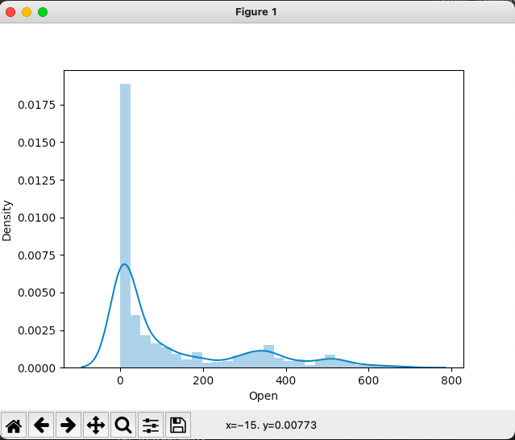

# 데이터 분석 과제 테스트
주어진 데이터를 분석하고, 원하는 형태에 맞게 submission 파일을 만드는 방식의 테스트   

### 문제 유형
- 수요 예측 
- 확률의 결과값 구하기
- 0/1 분류 

그럼 kaggle 데이터 분석을 통해 데이터 분석 과제 테스트를 대비해보겠다. 

### 데이터셋 - World Stock Prices
데이터 다운로드 링크 https://www.kaggle.com/datasets/nelgiriyewithana/world-stock-prices-daily-updating?resource=download   

> **Description**   
> This dataset offers a comprehensive historical record of stock prices for the world's most famous brands, with daily updates. The data spans from January 1, 2000, to the present day , providing an extensive timeline of stock market information for various global brands.

>**Key Features**   
> Date: The date of the stock price data.
> Open: The opening price of the stock on that date.
> High: The highest price the stock reached during the trading day.
> Low: The lowest price the stock reached during the trading day.
> Close: The closing price of the stock on that date.
> Volume: The trading volume, i.e., the number of shares traded on that date.
> Dividends: Dividends paid on that date (if any).
> Stock Splits: Information about stock splits (if any).
> Brand_Name: The name of the brand or company.
> Ticker: Ticker symbol for the stock.
> Industry_Tag: The industry category or sector to which the brand belongs.
> Country: The country where the brand is headquartered or primarily operates.

## 데이터셋 EDA 
탐색적 데이터 분석, EDA(Exploratory Data Analysis)는 모델링에 앞서 데이터를 살펴보는 모든 과정을 의미한다. 먼저 기본적인 EDA 순서는 다음과 같다.
1. 데이터를 임포트하여 메모리에 올린다.
2. 데이터의 모양을 확인 한다.
3. 데이터의 타입을 확인한다.
4. 데이터의 Null 값을 체크한다. 
5. 종속변수의 분포를 살펴본다.
6. 독립변수 - 명목형 변수의 분포를 살펴본다. 
7. 독립변수 - 수치형 변수의 분포를 살펴본다. 
8. 수치형, 명목형 변수간의 관계를 파악한다.

### 1. 패키지와 데이터 임포트
numpy, pandas, matplotlib, seaborn 이렇게 4가지 패키지는 EDA에서 거의 필수적으로 사용하는 라이브러리다. 
```python
import numpy as np
import pandas as pd
improt matplotlib.pyplot as plt
import seaborn as sns

stock_prices = pd.read_csv("World-Stock-Prices-Dataset.csv")
print(stock_prices)
```

### 2. 데이터 모양 확인
데이터프레임이름.head()를 통해 데이터 일부를 살펴볼 수 있고, .shape을 통해 열과 컬럼 수를 확인할 수 있다.  
```python
stock_prices.head(5)

                        Date        Open        High  ...  Country  Dividends  Stock Splits
0  2023-09-08 00:00:00-04:00    5.770000    5.840000  ...      usa        0.0           0.0
1  2023-09-08 00:00:00-04:00  443.559998  446.809998  ...      usa        0.0           0.0
2  2023-09-08 00:00:00-04:00  549.070007  552.379883  ...      usa        0.0           0.0
3  2023-09-08 00:00:00-04:00  136.860001  138.851898  ...      usa        0.0           0.0
4  2023-09-08 00:00:00-04:00  178.350006  180.238998  ...      usa        0.0           0.0

[5 rows x 12 columns]

print(stock_prices.shape)

(279226, 12)
```

### 3. 데이터 타입 확인
데이터프레임이름.info()를 통해 row의 수, 각 컬럼의 null 값 여부, 데이터 타입 등을 확인할 수 있다. 데이터 타입은 꼭 체크해야 하는데, 해당 변수 타입을 제대로 맞춰주어야 하기 때문이다.    
범주형 변수의 경우 object 또는 string, 수치형 변수의 경우 int64 혹은 float 64가 되어야 하는데 수치가 문자열로 들어가있다던지, 범주형 변수가 숫자로 들어가있다던지 하는 경우가 있다.  
```python
stock_prices.info()
<class 'pandas.core.frame.DataFrame'>
RangeIndex: 279226 entries, 0 to 279225
Data columns (total 12 columns):
 #   Column        Non-Null Count   Dtype  
---  ------        --------------   -----  
 0   Date          279226 non-null  object 
 1   Open          279226 non-null  float64
 2   High          279226 non-null  float64
 3   Low           279226 non-null  float64
 4   Close         279226 non-null  float64
 5   Volume        279226 non-null  float64
 6   Brand_Name    279226 non-null  object 
 7   Ticker        279226 non-null  object 
 8   Industry_Tag  279226 non-null  object 
 9   Country       279226 non-null  object 
 10  Dividends     279226 non-null  float64
 11  Stock Splits  279226 non-null  float64
dtypes: float64(7), object(5)
memory usage: 25.6+ MB
```

형 변환이 필요하다면 아래와 같이 하면 된다.
```python
stock_prices["Dividends"] = stock_prices["Dividends"].astype(object)
stock_prices["Stock Splits"] = stock_prices["Stock Splits"].astype(object)
```

### 4. 데이터 Null 값 확인
Null Check도 매우 중요한 작업 중 하나이다. 현실의 실제 데이터셋은 Null 값이 많은 경우가 대부분이다. 그럴 때 그 NULL을 어떻게 처리하느냐가 매우 중요하다. 먼저 확인해보자.

```python
stock_prices.isnull().sum()

Date            0
Open            0
High            0
Low             0
Close           0
Volume          0
Brand_Name      0
Ticker          0
Industry_Tag    0
Country         0
Dividends       0
Stock Splits    0
dtype: int64
```

null값을 처리하는 방법은 크게 2가지로 나눌 수 있다. 그 값을 빼고 하는 경우와 결측치를 대치하는 경우가 있다. 결측치가 많지 않다면 그냥 삭제를 해버릴 수도 있을 것이다. 그 방법을 **'complete data analysis'**라고 한다. 결측치가 많다면, 혹은 데이터 유실을 막고자 한다면 결측치를 중간값이나 평균값으로 대치하는 등의 방법이 있을 것이다. 그 방법을 **'Imputation'**이라고 한다. 그렇다면 전체 비율 중 몇센트가 결측치인지 확인해보자.
```python
missing_df = stock_prices.isnull().sum().reset_index()
missing_df.columns = ['column', 'count']
missing_df['ratio'] = missing_df['count']  / stock_prices.shape[0]
print(missing_df)

          column  count  ratio
0           Date      0    0.0
1           Open      0    0.0
2           High      0    0.0
3            Low      0    0.0
4          Close      0    0.0
5         Volume      0    0.0
6     Brand_Name      0    0.0
7         Ticker      0    0.0
8   Industry_Tag      0    0.0
9        Country      0    0.0
10     Dividends      0    0.0
11  Stock Splits      0    0.0
```

### 5. 종속변수의 분포를 살펴본다.
종속변수란 다른 변수들의 관계를 추론하여 최종적으로 예측하고자 하는 변수를 말한다. 그럼 여기서는 종목별 주식 시가를 예측하는 목표를 가지고 종속변수 Open의 분표를 살펴보겠다. 
netflix의 데이터를 활용하겠다. 

```python
nexflix_stock = stock_prices[stock_prices['Brand_Name'] == "netflix"]

sns.distplot(nexflix_stock['Open'])
plt.show()
```



### 6. 독립변수 - 명목형 변수의 분포를 살펴본다. 
데이터시각화.md 파일 참고

### 7. 독립변수 - 수치형 변수의 분포를 살펴본다. 
데이터시각화.md 파일 참고

### 8. 수치형, 명목형 변수간의 관계를 파악한다.
데이터시각화.md 파일 참고

### 데이터 분석 모델
검색이 안되므로 통째로 외우는 것이 좋다.
- 1. 선형 회귀(Linear Regression)
- 2. 로지스틱 회귀(Logistic Regression)
- 3. K-최근접 이웃(KNN)
- 4. 나이브 베이즈(Naive Bayes)
- 5. 결정 트리(Decision Tree)
- 6. 랜덤 포레스트(Random Forest)
- 7. XG부스트(XGBoost)
- 8. 라이트GBM(LightGBM)
- 9. K-평균 군집화(K Means Clustering)
- 10. 주성분 분석(PCA)   
(데이터_분석_모델.md 파일 참고)   

### Pandas 
자주 사용하는 메소드 정리   
(Pandas.md 파일 참고)
