# 데이터 시각화 도구
## 수치형 데이터
수치형 데이터에는 실수 형태의 연속형 데이터(키, 몸무게 등)와 정수 형태의 이산형 데이터가 있다. 수치형 데이터는 데이터가 어떻게 분포되어 있는지를 확인하는 것이 중요하다. 

### 변수 1개 시각화
* 히스토그램: plt.hist()   
    수치형 값들을 구간 별로 나눠 그리는 빈도수 그래프로 matplotblib을 사용한다.    
    - data[col].hist() 또는 plt.hist(data[col])
    - bins=20 (구간의 수)
    - density=True  (비율로 변환)
    ```python
    plt.hist(nexflix_stock['Open'], bins=20)
    plt.show()
    ```
    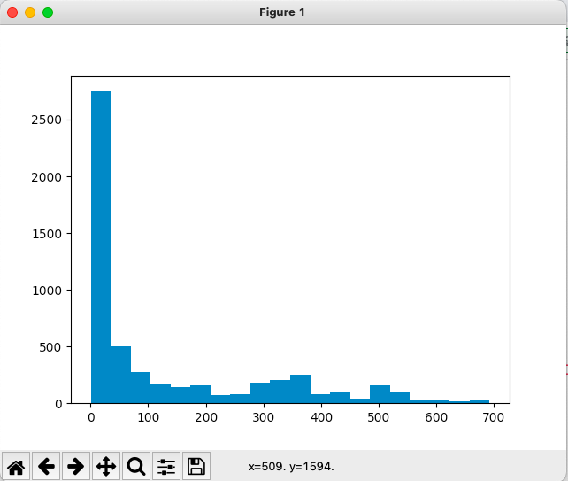    


* 분포도(히스토그램+커널밀도함수): sns.distplot()   
    seaborn(이하 sns)에서 제공하는 함수로 히스토그램과 커널밀도함수 그래프를 함께 그려주는 그래프다. 일반적으로 분포를 확인할 때 사용한다.
    - sns.displot(data[col], kde=True, hist=True)
    - kde의 디폴트 옵션은 True지만, False로 하면 히스토그램이 된다.
    - hist 또한 디폴트 옵션으로 False로 바꾸면 커널밀도함수 그래프가 된다.  
    ```python
    sns.displot(nexflix_stock['Open'], kde=True)
    plt.show()
    ```
    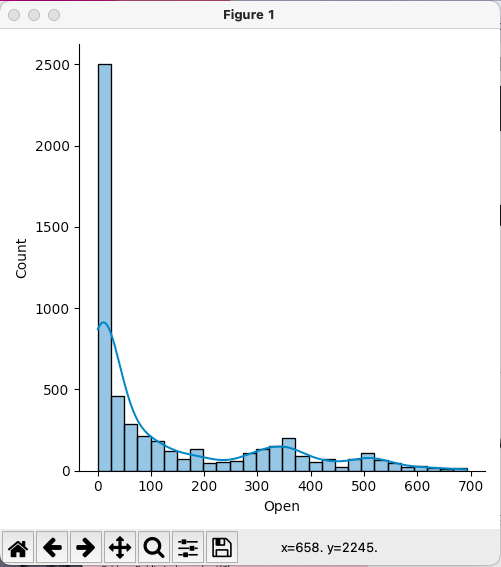   `

* 박스플롯: sns.boxplot()   
    위의 2개 그래프들은 전체 분포 현황을 직관적으로 보여준다면, boxplot은 박수와 수염 모양으로 최소값, 최대값, Q1, Q2, Q3 등의 여러 정보를 알려준다.
    - sns.boxplot(data[col])
    - sns.boxplot(x = col, data = data)   
    ```python
    sns.boxplot(stock_prices["Open"])
    plt.show()
    ```
    

### 변수 2개 이상 시각화 (변수 간 관계 확인)
* 히트맵: 숫자 값의 변수 끼리는 상관 계수를 구할 수 있는데, 상관계수를 표현하는 데에 사용한다.    
    - 상관계수: -1에서 1사이의 값으로 변수 간의 상관성을 나타낸다. -1에 가까울수록 반비례, 1에 가까울수록 비례, 0에 가까울수록 상관성은 낮다고 볼 수 있다. 
    - data.corr()
    ```python
    print(nexflix_stock[["Open", "Close"]].corr())

                Open     Close
    Open   1.000000  0.999673
    Close  0.999673  1.000000
    ```
    - sns.heatmap(data.cor)
    ```python
    stock_cor = nexflix_stock[["Open", "Close"]].corr()
sns.heatmap(stock_cor)
    ```

* 라인플롯: 두 수치형 데이터 사이의 관계를 선으로 나타낸다. x값에 따른 y값의 평균 값들을 선으로 이어주기 때문에 x축에는 이산형(discrete) 데이터, y축에는 연속형(continuous) 데이터를 사용한다.   
    ```python
    sns.lineplot(x='Open', y="Close", data=nexflix_stock)
    plt.show()
    ```
    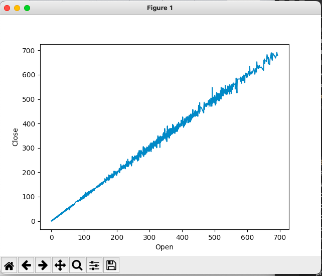   
    - 중심선은 평균, 선 옆의 옅은 색은 95% 신뢰구간을 의미한다.   
    - x축과 y축 모두 연속형 데이터를 쓰면 선이 깔끔하게 그려지지 않는다. 만약 x축에 이산형 데이터를 쓴다면 다음과 같이 그려질 것이다. 여기서는 seaborn의 hue라는 기능을 사용해 범주형 데이터를 넣어 범주형 데이터에 따라 달라지는 지도 확인해보았다.   
    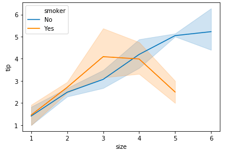

* 산점도: 두 수치형 데이터 간의 관계를 점으로 나타내는 방법으로 주로 x, y축 모두 연속형 데이터를 넣을 때 사용한다.   
    - sns.scatterplot(x, y, hue(범주형), data)   
    ```python
    sns.scatterplot(x = 'High', y = 'Low', data=stock_prices, hue = "Industry_Tag")
    plt.show()
    ```
    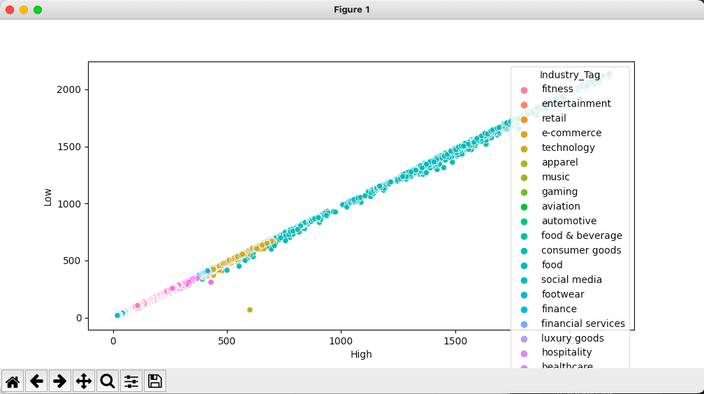

* 회귀선 + 산점도 (regplot): 회귀선과 산점도를 동시에 그려주는 유용한 함수로 주로 x, y 모두 연속형 데이터일 때 자주 사용한다. 
    - sns.regplot(x, y, data, marker, ci)
    - ci: 신뢰구간 퍼센트
    - marker: 점의 모양을 지정할 수 있는 옵션
    ```python
    sns.regplot(x='High', y='Low', data=stock_prices, marker='+', ci=99)
    plt.show()
    ```
    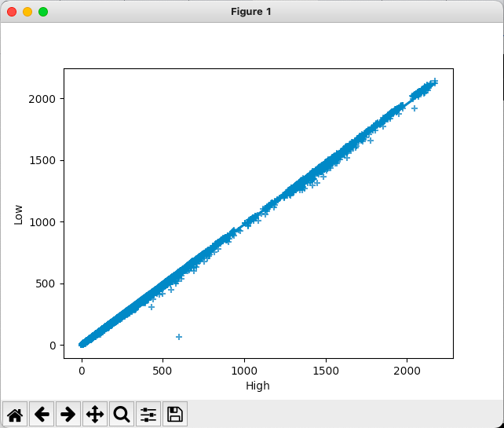

## 범주형 데이터 - 명목형 데이터
범주형 데이터에는 순서가 있는 데이터가 있는 순서형 데이터가 있고 순서가 없는 명목형 데이터가 있다. 접하는 대부분의 범주형 데이터는 명목형 데이터이며 여기서는 명목형 데이터 시각화 도구를 다루겠다.

## 범주형 변수 1개 시각화

### 카운트플롯
캐테코리별 개수, 즉 변수의 분포를 파악할 때 사용한다.
- sns.countplot(x, data)
```python
sns.countplot(x="Country", data=stock_prices)
plt.show()
```
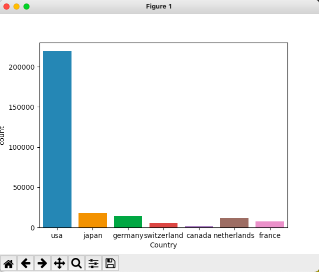
- 거꾸로 그리고 싶다면 sns.countplot(y, data)
```python
sns.countplot(y='Country', data=stock_prices)
plt.show()
```
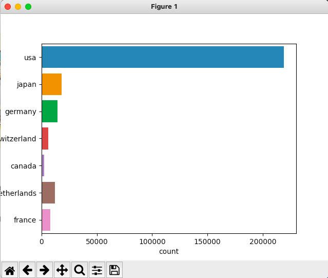

### 파이 그래프
Pie chart는 비율값과 이에 해당하는 레이블 값이 주어지면 비율에 맞게 파이 모양으로 그려지는 형태다. 
- plt.pie(x, labels, autopct)
- x는 비율, labels는 범주형 데이터의 레이블 리스트. autopct는 비율 표현 형식 설정
- 먼저 비율과 레이블 값을 리스트로 만들어야 한다.
- 그 리스트를 가지고 파이를 그린다.
```python
new = pd.DataFrame(stock_prices['Country'].value_counts()/stock_prices['Country'].count())
new.reset_index(inplace=True)
plt.pie(x=list(new['Country']),
        labels = list(new['index']),
        autopct = "%.2f%%")
plt.show()
```
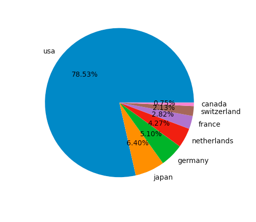

## 범주형 변수 2개 이상 시각화 (변수 간 관계 확인)
- 막대그래프: sns.barplot()    
        x = category   
        y = numerical 평균
- 포인트플롯: sns.pointplot()   
        x = category   
        y = numerical 평균   
- 박스플롯: sns.boxplot()   
        x = category   
        y = numerical 분포
- 바이올린플롯: sns.violinplot()   
        x = category   
        y = numerical 분포 & 양상   

### Barplot(막대그래프)
x축에는 범주형 데이터를, y축에는 범주값에 따른 데이터의 평균값을 구해서 그려진다.
- sns.barplot(x, y, data, estimator)
- estimator 옵션에는 평균값 외에도 원하는 지표를 넣을 수 있다. 
```python
stock_data = stock_prices[stock_prices.Industry_Tag.isin(["technology", "entertainment", "social media", "apparel", "fitness", "footwear", "food", "food & beverage"])]

sns.barplot(x = 'Industry_Tag', y = 'High', data=stock_data)
# sns.barplot(x = 'Industry_Tag', y = 'High', data=stock_data, estimator = mp.median)
plt.show()
```

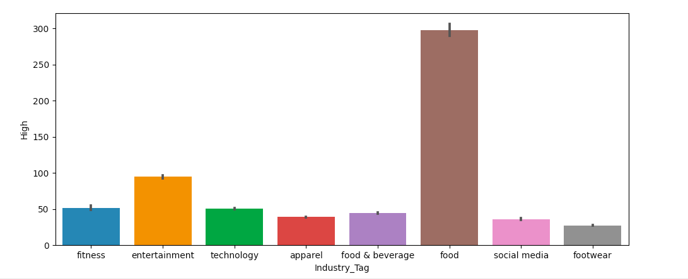

### Pointplot
barplot과 같은 기능이지만 bar가 아닌 category별 값이 점으로 찍히고 선으로 연결된다는 점에서 차이가 있다. 
- sns.pointplot(x, y, data, estimator)
```python
sns.pointplot(x='Industry_Tag', y = 'High', data=stock_data)
plt.show()
```
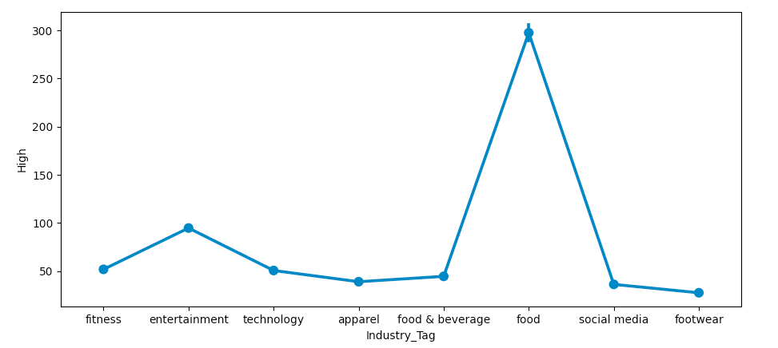

### Boxplot
앞에서는 y축에서 평균값을 보여줬다면 boxplot은 y축이 분포를 보여준다. 즉, x축에는 범주형 데이터가 있고 y축에는 범주에 따른 수치형 데이터의 분포 값이 나오는 것이다. 
- sns.boxplot(x, y, data)
```python
sns.boxplot(x='Industry_Tag', y='High', data=stock_data)
plt.show()
```
앞의 수치형 데이터에서 본 것처럼, 중위값, 평균, 꼬리의 길이 정도를 확인할 수 있다. 눕혀서 그리고 싶다면 x와 y의 위치를 바꾸면 된다.  


### Violinplot: Boxplot + kdeplot
boxplot은 분포를 확인하기에 좋지만 분산을 확인하기에는 모호하다는 단점이 있다. 분산을 확인하기 좋은 것이 바로 바이올린플롯이며 기능은 boxplot과 같지만 커널밀도함수 모양을 가지고 있다고 이해하면 된다.
- sns.violinplot(x, y, hue, data, split)
- hue: 원하는 카테고리별로 분포를 나누어 볼 수 있는 옵션
- split: False가 디폴트지만 True로 설정하면 hue의 조건으로 나눠진 분포를 절반씩 그려서 이어붙여준다. 
```python
sns.violinplot(x='Industry_Tag', y='High', data=stock_data)
food_stock = stock_prices[stock_prices.Industry_Tag.isin(["food", "food & beverage"])]
sns.violinplot(x="Brand_Name", y="High", hue="Industry_Tag", data=food_stock)
plt.show()
```


## 여러 그래프를 동시에 그리기 - subplots
실제 EDA를 하다보면 아래와 같이 여러 가지 그래프를 한꺼번에 그리는 경우가 많다.   
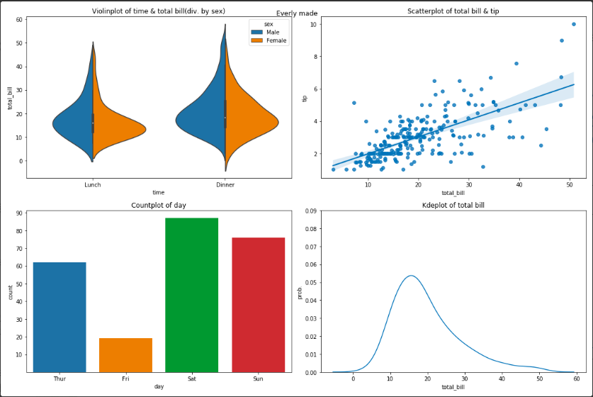
그림처럼 여러가지 그래프를 하나의 plot에 그리는 방법으로 아래 함수를 사용해보겠다.
- plt.subplots()

### step1. fig(도화지), axs(축)을 설정한다.
- fig, (ax1, ax2) = plt.subplots(행 개수, 열 개수, figsize=(전체 가로 길이, 전체 세로 길이))   

### step2. 각 axs에 맞는 그림을 그린다.
측 ax를 반드시 설정해야 한다. 단 sns가 아닌 plt 기반 그림은 ax를 쓰지 않는다.   
- ax1 = sns.plot(ax = ax1)
- ax2 = sns.plot(ax = ax2)


### step3. 각 axs별 그림을 꾸민다. 
- ax1.set_title("제목")
- ax1.set_xlabel("x축 이름")
- ax1.set_ylabel("y축 이름)
- ax1.set_xticks(x축 눈금 설정)
- ax1.set_yticks(y축 눈금 설정)
- ax1.tick_params(axis='x', label_rotation=각도)

### step4. 레이아웃 마무리를 해준다.
- fig.tight_layout()
- plt.rc('font', size=폰트사이즈)
- plt.show()

그럼 위의 단계대로 직접 코드를 작성해보자. 여기서는 gaming 종목과 automotive 종목을 비교해볼 것이며 일본과 미국의 브랜드에 한정을 지어서 살펴보겠다.

```python
import numpy as np
import pandas as pd
import matplotlib.pyplot as plt
import seaborn as sns

stock_prices = pd.read_csv("World-Stock-Prices-Dataset.csv")
stock_data = stock_prices[stock_prices.Country.isin(["usa", "japan"])]
stock_data = stock_data[stock_data.Industry_Tag.isin(['gaming', 'automotive'])]

fig, axs = plt.subplots(2, 2, figsize=(8,8))
ax1, ax2, ax3, ax4 = axs.flatten()

ax1 = sns.boxplot(x='Industry_Tag', y='High', data=stock_data, ax=ax1)
ax2 = sns.barplot(x = 'Industry_Tag', y = 'High', data=stock_data, ax=ax2)
ax3 = sns.pointplot(x='Industry_Tag', y = 'High', data=stock_data, ax=ax3)
ax4 = sns.violinplot(x='Industry_Tag', y = 'High', hue="Country", data=stock_data, ax=ax4)
plt.show()
```

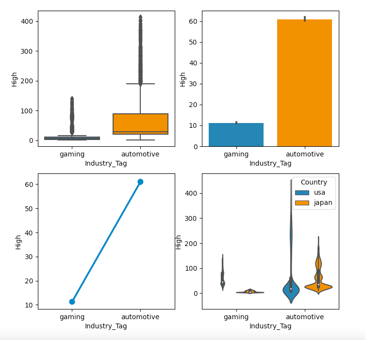
   
타이틀, 라벨, 눈금 범위 등의 옵션을 추가해보자.
```python
ax1.set_title("Stock price distribution by industry")
ax2.set_title("Average stock price by industry")
ax3.set_title("Average stock price by industry")
ax4.set_title("Stock price distribution by industry(usa,japan)")
# 그래프 사이 간격 조정
fig.tight_layout()

plt.show()
```
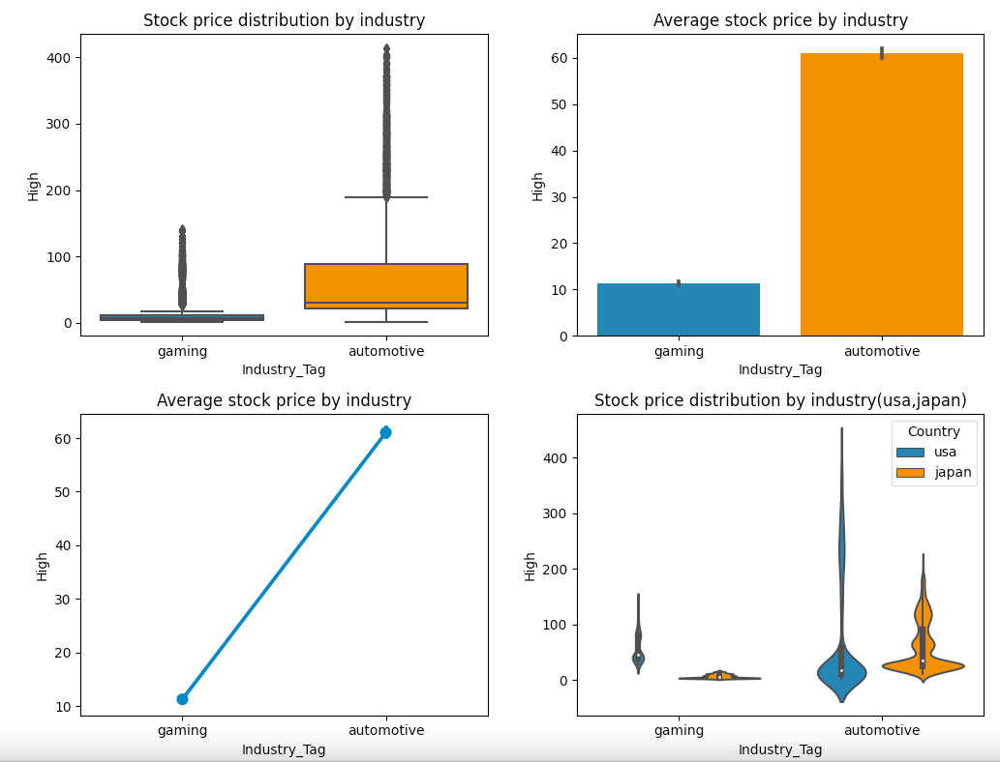


```python
# y축 이름 설정 추가
ax2.set_ylabel('average of High prices')
# y축 눈금 범위 변경
ax4.set_yticks(np.arange(0, 350, 50))
# 전체타이틀 & 그래프 사이 간격 조정
fig.suptitle("Stock prices data visualization")
fig.tight_layout()

plt.show()
```
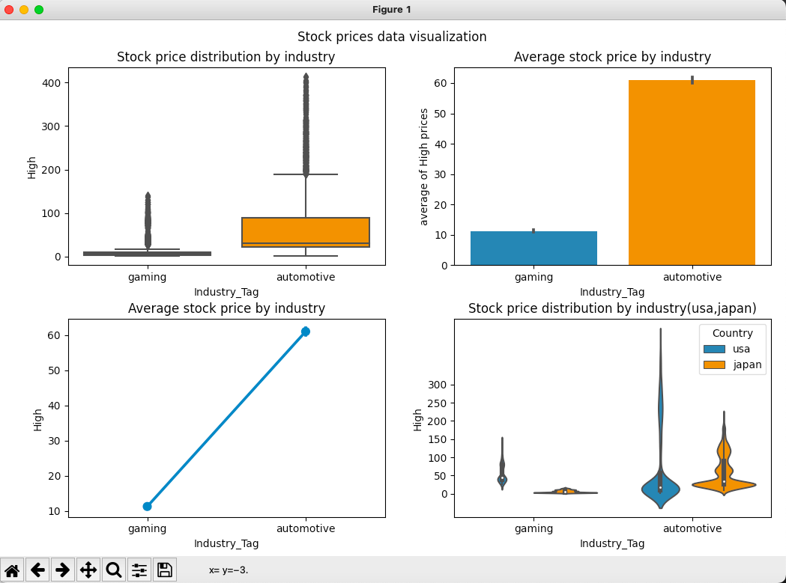