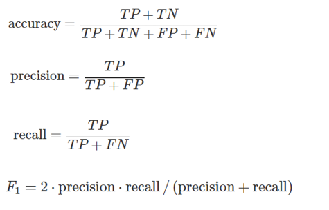

## 분류모델 성능평가지표
분류 모델의 결과에는 네 종류가 있다.  
- 정답이 Positive인데, Positive으로 제대로 분류 된 것은 True Positive (TP)
- 정답이 Negative인데 Negative으로 제대로 분류 된 것은 True Negative (TN)
- 정답이 Positive인데 Negative으로 잘못 분류 된 것은 False Negative (FN)
- 정답이 Negative인데 Positive으로 잘못 분류 된 것은 False Positive (FP)

### 1. Accuracy
전체 데이터 중에서, 제대로 분류된 데이터의 비율을 말한다.   
Error Rate는 Accuracy 와 반대로, 전체 데이터 중에서 잘못 분류한 비율을 나타낸다.

### 2. Precision
Positive으로 분류된 데이터들 중, 정답이 Positive였던 데이터의 비율

### 3. Recall (Sensitivity, 민감도)
정답이 Positive인 데이터들 중, Positive로 잘 분류된 데이터들의 비율

### 4. F1 score
Precision(정밀도)와 Recall(재현율)의 가중조화평균(weight harmonic average)

```python
from sklearn.metrics import accuracy_score, precision_score, recall_score, f1_score, roc_auc_score

model = RandomForestClassifier(random_state=123)
model.fit(x_train, y_train)

pred_y = model.predict(x_test)

print("정확도 Accuracy: {:.2f}".format(accuracy_score(test_y, pred_y)*100))
print("정밀도 Precision: {:.2f}".format(precision_score(test_y, pred_y)*100))
print("재현율 Recall: {:.2f}".format(recall_score(test_y, pred_y)*100))
print("f1 score: {:.2f}".format(f1_score(test_y, pred_y)*100))
```


## 회귀모델 성능평가지표
### 1. MAE (Mean Absolute Error)
실제값과 예측값 차이의 평균으로, 가깝게 예측할수록 값이 작다. 에러에 따른 손실이 선형적으로 올라갈 때 적합하다.
```python
from sklearn.metrics import mean_absolute_error
mean_absolute_error(y_test, y_pred)
```

### 2. MSE
오차값들의 제곱의 평균으로, 가깝게 예측할수록 값이 작으며 절대값을 안해도 된다. 에러에 제곱을 하기 때문에 에러가 크면 클수록 그에 따른 가중치가 높이 반영된다.
```python
from sklearn.metrics import mean_squared_error 
mean_squared_error(y_test, y_pred)
```

### 3. RMSE 
MSE 값은 오차의 제곱을 구하므로 값이 커지기 때문에 MSE (Mean Squared Error)에 루트를 씌운 RMSE (Root Mean Squared Error) 값을 사용하기도 한다. 일반적으로 많이 쓰인다.
```python
from sklearn.metrics import mean_squared_error 
MSE = mean_squared_error(y_test, y_pred) 
RMSE = np.sqrt(MSE)
```

### 4. R2 Score
위의 지표들과 달리 값이 1에 가까울수록 성능이 좋다. r2 score는 0과 1사이의 값을 가지며 1에 가까울수록 선형회귀 모델이 데이터에 대하여 높은 연관성을 가지고 있다고 해석할 수 있다. 
```python
from sklearn.metrics import r2_score
r2 = r2_score(y, model.predict(x)
```