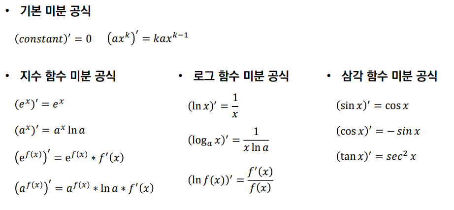

# 미분 (Ordinary derivative)

### 도함수(Derivative) 𝑓′(𝑥)란?
* 입력 𝑥에 대하여, 함수 𝑓의 기울기(gradient)를 알려주는 함수   
* 입력 𝑥에 대하여, 함수 𝑓가 얼마나 민감하게 변화하는지(순간 변화율)를 알려주는 함수   

### 미분(Differentiation)이란? 
-> 도함수 𝑓′(𝑥)를 계산하는 일   
따라서 어떠한 함수 𝑓(𝑥)가 있을 때, 특정한 점 𝑎의 위치에서의 기울기(gradient) 혹은 순간 변화율 값을 구하 고 싶다면 𝑓′(𝑎)를 계산하면 된다.   

### 기울기의 정의는? 
-> ‘𝑓(𝑥)의 변화량/𝑥의 변화량’   
특정 함수에서 𝑥가 ℎ만큼 변할 때의 기울기를 계산해보자.   
미분은 인공지능 분야에서, 뉴럴 네트워크를 학습(training)을 시키기 위한 과정에서 사용되며 주로 뉴럴 네트워크의 파라미터를 기울기 값을 기준으로 학습을 시키는 방법을 주로 이용한다.   
실제로 ℎ를 0.0001 정도로 설정하여 근사할 수도 있으나 머신러닝 라이브러리에서는 실제로 도함수를 계산하여 학습을 진행하며, 레이어가 많으므로 연쇄법칙(chain-rule)을 이용하게 된다.   

# 편미분 (Partial derivative)

### 편미분이란? 
다변수 함수(multivariate function)에서, 하나의 변수를 기준으로 미분하는 것이다.   
미분을 할 때 다른 변수는 모두 상수(constant) 취급한다.   
실제로 머신러닝 모델은 입력(input)이나 가중치(weight) 값들이 다변수 벡터 형태이다.   
따라서 머신러닝 모델에서 학습(training) 과정은 편미분을 통해 이루어진다.   
