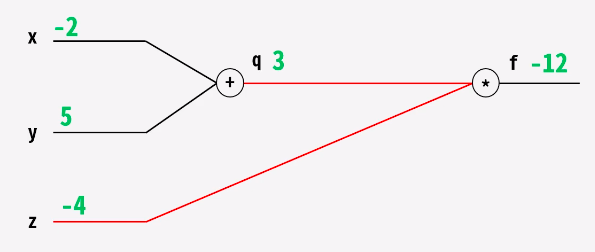

# 오차 역전파 (Backpropagation)란?
artificial neural network를 학습시키기 위한 알고리즘 중 하나로, 뽑고자 하는 타깃값과 모델이 계산한 output 사이의 오차값을 다시 뒤로 전파해가면서 각 노드의 weight 값을 update 해가는 로직이다.

### 식
f(x,y,z) = (x+y)z
q = x+y
f = qz
x = -2, y = 5, z = -4 일 때
   
위와 같은 계산을 Forward Pass 라고 한다.
그렇다면 gradient를 살펴보자.

**local gradient** 
- x의 변화량에 따른 q의 변화량 dq /   dx = 1 
- y의 변화량에 따른 q의 변화량 dq / dy = 1
- z의 변화량에 따른 f()의 변화량 = df / dz = x+y = 3
**global gradient**
- q의 변화량에 따른 f의 변화량 = df / dq = z = -4

중요한 것은 df/dx 와 df/dy 을 구하는 것. 
구하기 위한 방법으로 chain rule을 사용한다.
df/dx = df*dq / dq*dx = df/dq * dq/dx = -4
df/dy = df*dq / dq*dy = df/dq * dq/dy = -4

앞서 말한 forward pass, 즉 순방향 계산 시에 local gradient를 미리 구할 수 있다. 그렇다면 back propagation, back pass 시에 loss를 어떻게 구할 수 있을까?

구하고자 하는 것은 dLoss/dx이다. 바로 직전의 global gradient 값이 있다면 단순 곱셈을 통해 현재의 global gradient를 알 수 있다.

local gradient = dq/dx
grabal gradient = dLoss/dq

dLoss/dx 를 구하기 위해 또 한번 chain rule을 활용하면 다음과 같다.
dLoss/dx =  dq/dx * dLoss/dq = local gradient x global gradient 

### 결론
- 아무리 깊고 복잡한 층의 neural network여도 chain rule을 활용하여 미분 값을 구할 수 있다.
- forward pass 시에 local gradient를 미리 계산하여 저장해둔다.
- local gradient 와 global gradient를 backward pass 시 곱하여 최종 미분 값을 얻는다.