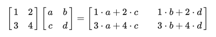
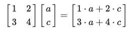
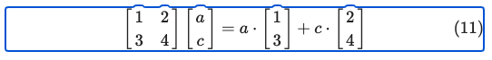
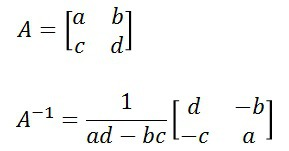

# 기초 선형대수학 이론
## 벡터의 기본연산
### 벡터란 무엇인가?
물리학에서 말하는 ‘크기와 방향으로 정의되는 값’으로 화살표와 같은 것으로 이해할 수 있다. 또한 방향에 따라 숫자를 순서대로 나열한 것이라고도 생각할 수 있다.   
하지만 수학적으로 가장 의미있는 정의는 아래와 같다.   
**벡터란 벡터 공간의 원소이다.**   

벡터 공간이란 (V, +, *) 세가지 요소가 정의되고 성립되는 공간을 말한다.   
지금으로썬 너무나 모호하게 들리는 추상적인 정의이지만, 이러한 추상성이 벡터의 개념을 더 넓은 범위로 확장하고 이를 이용해 선형대수학의 세계에서 일어나는 많은 일들을 설명할 수 있게 된다.   

### 벡터의 기본 연산 - 상수배 (scalar multipliation)
임의의 집합 V(≠ϕ)에 대해    
임의의 벡터 x∈V 와 스칼라 k∈R 에 대하여 다음이 성립하여야 한다.   

x ∈ V, k ∈ R ⇒ kx ∈ V   
즉, 상수배를 해주더라도 방향이 유지되고 벡터 공간에 존재해야 한다는 것이다.   

### 벡터의 기본 연산 - 벡터 간의 합
임의의 집합 V(≠ϕ)에 대해 임의의 벡터 x,y ∈ V 에 대하여 다음이 성립하여야 한다.   

x, y ∈ V ⇒ x + y ∈ V   
즉, 벡터끼리의 합이 벡터 공간에 존재해야 한다.    
그림으로 설명하자면 주어진 두 화살표에 대해 화살표의 크기와 방향을 합해주어 평행사변형 꼴을 이룰 수 있도록 합해진 벡터가 출력되면 된다.   

### 벡터 간의 선형 결합
기본적으로 상수배와 벡터 간의 합이 중요한 것은 이 두 연산이 잘 정의되는 것(entity)들은 선형성을 만족한다고 할 수 있기 때문이다.   
좀 더 근본적으로는 벡터 간의 선형 결합(linear combination)을 표현하기 위해 상수배와 벡터 간의 합은 필수적인 개념이다.   

## 행렬곱
고등 수학 과정에서 행렬이 제외되었기 때문에 행렬곱을 마주할 때마다 곱셈 방식이 익숙하지 않아 어렵게 느껴졌다.   
행렬의 곱은 일반적으로 다음과 같이 계산한다.   
   
   

열벡터의 선형 결합을 행렬 곱으로 이해할 수 있다.   
   
이 결과는 다음과 같이 생각할 수 있다.   
열벡터의 선형 결합을 행렬 곱으로 이해할 수 있다.   
   
다시 말해, 행렬과 백터의 곱은 행렬을 구성하고 있는 두 열벡터의 선형 결합을 표현한 것이라고 말할 수 있다.   

## 벡터의 내적
아래 페이지 참고   
   

## 벡터와 유사도
A 벡터와 B 벡터의 유사도를 구하는 것은 방향 사이 각의 크기를 구하는 것과 같다.   
similiarty(A, B) = cos(사이각) = A⋅B / ||A|| ||B||   

## 벡터의 Norm
* 1-Norm    
  L1 distance로 맨하탄 거리(Manhatten Distance)라고도 한다. 각 좌표 차이의 절대값의 합   
* 2-Norm     
  L2 distance로 유클리디안 거리라고도 한다. 일반적인 거리 개념으로 각 좌표 차이의 제곱의 합을 루트씌운 값   
* 3-Norm    
  L3 distance로 유클리디안 거리와 비슷하지만 세제곱을 하는 차이가 있다.    

## 행렬과 선형 변환
1. Identity Matrix(Unit Matrix, 단위 행렬)
   행렬에서 [i, i] 는 1, 나머지는 0인 행렬로, 자기 자신 값만 True를 갖는다. 통계에서 이 행렬을 I 또는 E로 표시한다. 

2. Transpose(전치 행렬)
  행과 열을 뒤바꾼 것으로 행렬 위 첨자에 T를 붙인다.   
  행렬 A가 있을 때, (AT)ij = Aji    

3. Inverse Matrix(역행렬)   
A의 역행렬은 곱해서 단위행렬이 나오게 하는 행렬을 말한다. 즉 B가 A의 역행렬인 경우 AB = I, BA = I 이다. 역행렬을 구하는 방법은 다음과 같다.    

아래 페이지를 참고   

